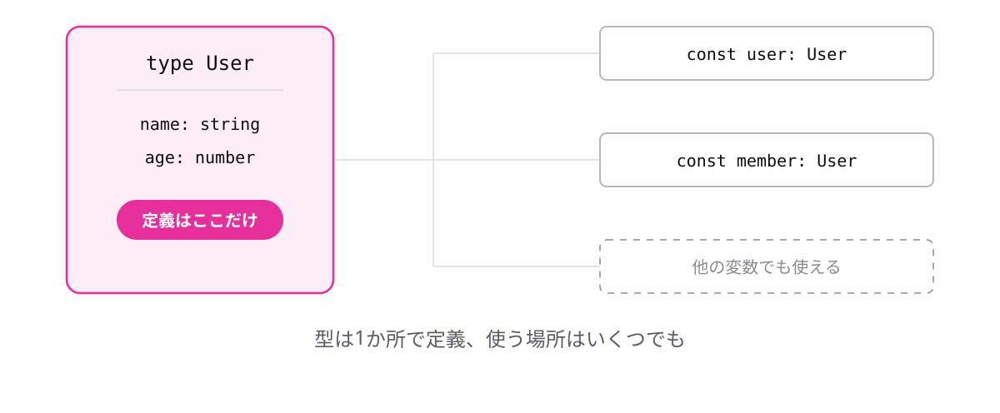

<!-- _class: lead -->

# 3-4-1
# 型エイリアス

TypeScript入門研修 — Module 3 / レッスン3-4

<!-- ノート: Module 3の最後のレッスンです。前のレッスンで感じた「型を書くのが長い」という不満を、ここで解消します。 -->

---

## なぜ必要か

- `{ name: string; age: number }` を、使う場所すべてに書くことになる
- 項目が1つ増えたら、書いた場所すべてを直すことになる

<!-- ノート: つかみ。3-3-3で書いた型注釈の読みにくさを思い出してもらう。同じ情報を何か所にも書くのは、1-2-5で「推論に任せる」と決めた理由と同じ問題。 -->

---

## 結論

**`type`で型に名前を付けると、同じ形を何度でも使い回せる**

```
type 型の名前 = 型;
```

<!-- ノート: 結論を先に言い切る。エイリアスは「別名」の意味。新しい型を作るのではなく、既にある型に呼び名を付けるだけ。型名は大文字始まりにするのが慣習。 -->

---

## 最小のコード

```ts
type User = {
  name: string;
  age: number;
};

const user: User = { name: "田中", age: 28 };
const member: User = { name: "佐藤", age: 34 };
```

- 変更は`type`の1か所だけで済む

<!-- ノート: 型を先に定義し、あとは名前で参照する。項目を追加したいときはtypeの中に1行足すだけ。使っている全箇所が自動で厳しくなり、足りない場所はエラーで教えてくれる。 -->

---

## 定義は1か所、参照は何度でも



<!-- ノート: 1つの定義から複数の場所が参照している図。型は「仕様書」でもあるので、名前が付くと読み手にも意図が伝わる。Userという名前自体が情報になる。 -->

---

<!-- _class: summary -->

## まとめ

**`type`で型に名前を付けると、同じ形を何度でも使い回せる**

<!-- ノート: 結論の再掲だけ。ところで、必須ではない項目はどう書くのか、という問いを残して締める。 -->
