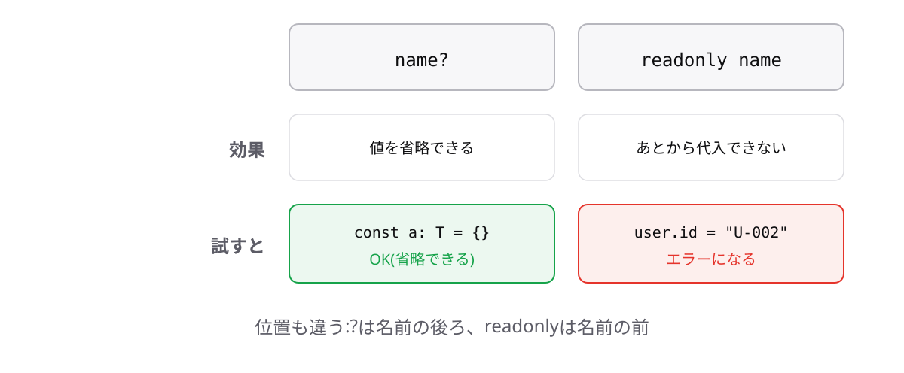

<!-- _class: lead -->

# 3-4-3
# readonlyプロパティ

TypeScript入門研修 — Module 3 / レッスン3-4

<!-- ノート: 3-2-2で「constでも中身は変えられる」と学びました。では中身を守りたいときはどうするのか。その答えです。 -->

---

## なぜ必要か

- ユーザーIDや注文番号のように、作ったあと絶対に変わらない項目がある
- `const`では中身の書き換えを止められない

<!-- ノート: つかみ。3-2-2の宿題の回収。constが守るのは変数名の貼り先だけだった。プロパティ単位で守る仕組みが別に用意されている。 -->

---

## 結論

**プロパティの前に`readonly`を付けると、後から書き換えられなくなる**

<!-- ノート: 結論を先に言い切る。readonlyは「読み取り専用」の意味。プロパティ名の前に置く(オプショナルの?は後ろだったので、位置が逆だと注意する)。 -->

---

## 最小のコード

```ts
type User = {
  readonly id: string;
  name: string;
};

const user: User = { id: "U-001", name: "田中" };

user.name = "田中太郎"; // OK
user.id = "U-002";
// エラー: Cannot assign to 'id' because it is
// a read-only property.
```

<!-- ノート: nameは変えられ、idは弾かれる。エラーメッセージは1-1-2のconstで見たものとよく似ている。「変えられない」という約束を型で表現している点は共通。 -->

---

## プロパティに付ける2つの目印



<!-- ノート: ?は「あってもなくてもよい」、readonlyは「あるが変えられない」。役割がまったく違うことを図で整理する。位置も違う(?は名前の後ろ、readonlyは名前の前)ことをもう一度確認する。 -->

---

<!-- _class: summary -->

## まとめ

**プロパティの前に`readonly`を付けると、後から書き換えられなくなる**

<!-- ノート: 結論の再掲だけ。道具がそろったので、次は実務のデータの形を作ってみると予告して締める。 -->
