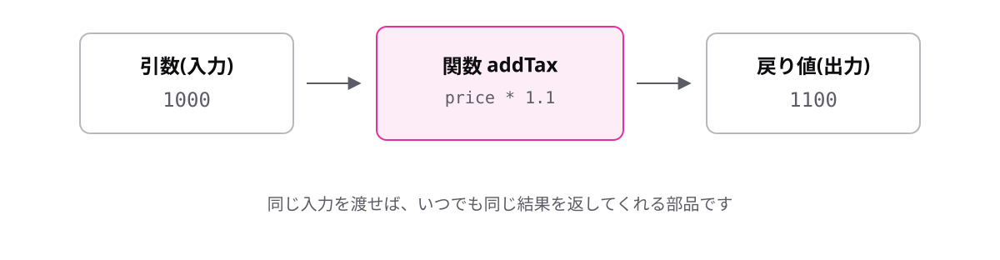
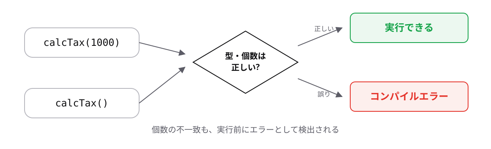

# レッスン4-1 関数の基本

## このレッスンの目標

- [ ] 関数・引数・戻り値・呼び出しの関係を説明できる
- [ ] 関数宣言を書き、引数に型注釈を付けられる
- [ ] `return`の2つの働きを説明できる

## 4-1-1 関数とは

> **関数は、入力を受け取って結果を返す処理に名前を付けたもの**

Module 3の最後で、税込価格の計算を何度も書いていました。同じ処理をコピーすると、直すときも全部直すことになり、必ず片方だけ直されて食い違います。

- **引数** — 関数へ渡す入力
- **戻り値** — 関数から返ってくる結果
- **呼び出し** — 名前を書いて関数を動かすこと

```ts
function double(value: number): number {
  return value * 2;
}

console.log(double(5)); // => 10
console.log(double(120)); // => 240
```

`value`が引数、`value * 2`の結果が戻り値、`double(5)`が呼び出しです。1回書けば何度でも呼び出せます。



中身がどう書かれているかを知らなくても、入口と出口だけ分かれば使えます。これが「名前を付ける」ことの価値です。

## 4-1-2 関数宣言と引数の型注釈

> **引数には必ず型注釈を書く。ここだけは推論に任せられない**

レッスン1-2で「初期値があれば推論に任せる」と決めましたが、引数には初期値がありません。だから型を書く必要があります。「書くのは推論できないときだけ」という方針が、そのまま当てはまる場面です。

```
function 関数名(引数: 型): 戻り値の型 {
  処理
}
```

```ts
function calcTax(price: number): number {
  return price * 0.1;
}

console.log(calcTax(1000)); // => 100
```

この書き方を**関数宣言**と呼びます。引数のかっこの中に「名前: 型」を書き、かっこの外のコロンの後ろに戻り値の型を書きます。引数が2つ以上ならカンマで区切ります。

戻り値の型は推論できるので省略もできますが、本研修では書く方針にします。

書き忘れるとチェックが効かなくなります。

```ts
function calcTax(price) {
  return price * 0.1;
}
// エラー: Parameter 'price' implicitly has an 'any' type.
```

`implicitly`は「暗黙のうちに」、`any`は「何でも」の意味です。この状態だと文字列を渡しても止めてくれません(`any`そのものはModule 5で扱います)。

## 4-1-3 returnで値を返す

> **`return`は値を返し、同時にその関数の処理をそこで終える**

計算しただけでは、呼び出した側は結果を受け取れません。`console.log`で表示するのと、値を返すのはまったく違います。表示は画面に出すだけで、呼び出し元は何も受け取っていません。

```ts
function calcTotal(price: number): number {
  const tax = price * 0.1;
  return price + tax;
  console.log("ここは実行されない");
}

console.log(calcTotal(1000)); // => 1100
```

`return`の後ろの行は実行されません。エディター上でも薄く表示されます。**返した時点で関数の仕事は終わり**です。

この「終える」性質には使いどころがあります。

```ts
function getLabel(stock: number): string {
  if (stock === 0) {
    return "在庫切れ";
  }
  return "在庫あり";
}
```

条件に当たったらそこで抜けます(早期リターン)。`else`を書かずに済むのでネストが浅くなり、読みやすくなります。実務で非常によく使う形です。

## 4-1-4 引数は型も個数もチェックされる

> **呼び出し側は、引数の型だけでなく個数もチェックされる**

関数は「他人が作ったものを使う」場面がほとんどです。ライブラリーもチームメンバーのコードも、中身を読まずに使います。だから呼び出し側のチェックが実務では効いてきます。

```ts
function calcTax(price: number): number {
  return price * 0.1;
}

calcTax("1000");
// エラー: Argument of type 'string' is not
// assignable to parameter of type 'number'.

calcTax();
// エラー: Expected 1 arguments, but got 0.
```

`argument`は「渡した値」、`parameter`は「受け取る側」です。レッスン3-2の`push`で見たメッセージと同じ形です。



JavaScriptでは個数が合わなくても動いてしまい、足りない引数は`undefined`になります。TypeScriptは実行前に止めてくれます。

## もっと知りたい人へ

- [関数宣言](https://typescriptbook.jp/reference/functions/function-declaration) — 関数宣言の詳しい説明
- [関数の型注釈](https://typescriptbook.jp/reference/functions/function-expression) — 引数と戻り値の型

---

演習は [practice.md](practice.md) にあります。
