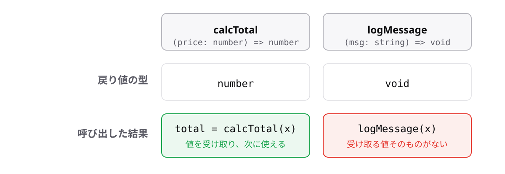

<!-- _class: lead -->

# 4-4-1
# void型

TypeScript入門 — Module 4 / レッスン4-4

<!-- ノート: レッスン4-4では戻り値の側を掘り下げます。まずは「返さない」場合の書き方から。 -->

---

## なぜ必要か

- 画面に表示するだけ、記録するだけ、という関数がある
- 戻り値の型を必ず書くと決めたのに、何と書けばよいのか分からない

<!-- ノート: つかみ。4-1-2で戻り値の型は書く方針にした。ではログ出力だけの関数はどう書くのか、という素朴な疑問を拾う。 -->

---

## 結論

**値を返さない関数の戻り値の型は`void`と書く**

- `void`(ヴォイド) = 「何もない」という意味の型

<!-- ノート: 結論を先に言い切る。voidは「空虚」の意味。1-6で学んだundefinedとは別物で、こちらは「返す値が存在しない」ことを表す型だと区別する。 -->

---

## 最小のコード

```ts
const logOrder = (name: string): void => {
  console.log(`注文: ${name}`);
};

logOrder("コーヒー"); // => "注文: コーヒー"
```

- `return`を書かない。書いても値は付けない

<!-- ノート: console.logは表示するだけで、値を返していない。4-1-3で確認した「表示と返却は別物」がここで型として現れる。処理を途中で抜けたいときは値なしのreturnだけ書ける。 -->

---

## 値を返す関数と、戻り値がない関数



<!-- ノート: 左は結果が出てくる関数、右は処理をするだけで何も出てこない関数。voidの関数の戻り値を変数に入れようとすると、使えない値が入ることになる。実際にはundefinedが入るが、型の上ではvoidなので使ってはいけない、と伝える。 -->

---

<!-- _class: summary -->

## まとめ

**値を返さない関数の戻り値の型は`void`と書く**

<!-- ノート: 結論の再掲だけ。そもそも戻り値の型は推論できるのに、なぜ書くのかという問いを残して締める。 -->
