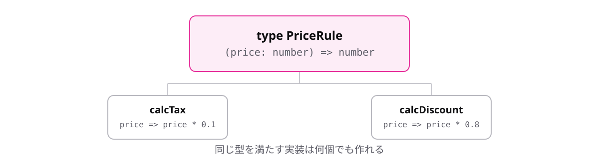

<!-- _class: lead -->

# 4-4-4
# 関数の型に名前を付ける

TypeScript入門研修 — Module 4 / レッスン4-4

<!-- ノート: レッスン4-4の最後です。3-4-1で学んだ型エイリアスが、関数の型にもそのまま使えます。 -->

---

## なぜ必要か

- `(price: number) => number` を書く場所すべてに繰り返すことになる
- 同じ形の関数が複数あるとき、意図が伝わらない

<!-- ノート: つかみ。3-4-1でオブジェクトの型に感じたのとまったく同じ不満。解決策も同じだと分かると、覚えることが増えない。 -->

---

## 結論

**関数の型も型エイリアスで名前を付けられる。名前が仕様書になる**

<!-- ノート: 結論を先に言い切る。type で名前を付けるだけ。オブジェクトの型でも関数の型でも書き方は同じ。「型エイリアスはあらゆる型に付けられる」と一般化して伝える。 -->

---

## 最小のコード

```ts
type PriceRule = (price: number) => number;

const calcTax: PriceRule = (price) => price * 0.1;
const calcDiscount: PriceRule = (price) => price * 0.8;

console.log(calcTax(1000)); // => 100
console.log(calcDiscount(1000)); // => 800
```

<!-- ノート: 2つの関数が同じ形をしていることが、PriceRuleという名前で表現されている。実装側は引数の型注釈を省略できる(型エイリアス側から推論される)。 -->

---

## 関数の型は「入力と出力の仕様書」



<!-- ノート: 型を先に決めて、それに合う実装を書く。型が「こういう関数を作れ」という指示になっている。実装が仕様から外れれば、その場でエラーになる。この考え方は次のレッスンのコールバックで本領を発揮する。 -->

---

<!-- _class: summary -->

## まとめ

**関数の型も型エイリアスで名前を付けられる。名前が仕様書になる**

<!-- ノート: 結論の再掲だけ。レッスン4-4はここまで。関数が値で、型も書けるなら、引数として渡せるはずだと引きを作って締める。 -->
