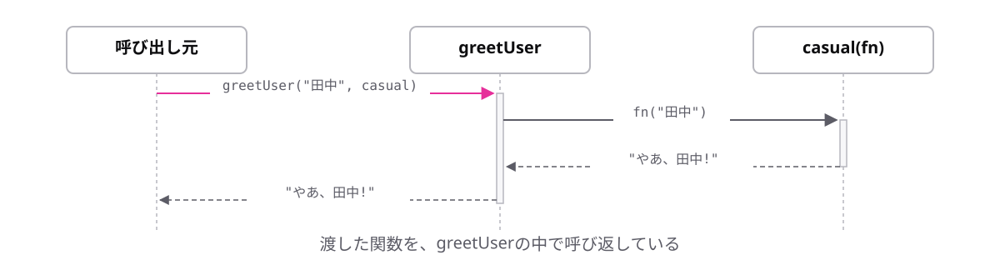

# レッスン4-5 コールバック

## このレッスンの目標

- [ ] 関数を引数として渡せる
- [ ] `map`と`filter`を使い分けられる
- [ ] メソッドチェーンで2段階の処理を書ける

## 4-5-1 コールバック

> **関数は値なので、他の関数に引数として渡せる**

「一覧を作る」処理は同じで、「1件をどう整形するか」だけ変えたい。処理の一部分だけを差し替えたい場面が実務には多くあります。

引数として渡される関数を**コールバック**と呼びます。渡された側が、あとで呼び出す(call back)ためです。

```ts
type Formatter = (name: string) => string;

const shout: Formatter = (name) => `${name}!!`;

const show = (name: string, format: Formatter): void => {
  console.log(format(name));
};

show("コーヒー", shout); // => "コーヒー!!"
```

`show`の2つ目の引数がコールバックです。型は4-4-4で学んだ関数型の型エイリアスで書けます。**`show`の中身を変えずに、渡す関数を差し替えるだけで挙動が変わります。**



よくある間違いは、関数ではなく実行結果を渡してしまうことです。

```ts
show("コーヒー", shout("コーヒー"));
// エラー: Argument of type 'string' is not assignable
// to parameter of type 'Formatter'.
```

**かっこを付けると「呼び出した結果」になります。** 関数そのものを渡すときはかっこを付けません。

## 4-5-2 map

> **`map`は、全要素を変換した新しい配列を作る**

「全商品の税込価格の配列がほしい」のような変換は頻出します。`for-of`と`push`でも書けますが、毎回4〜5行の同じ形になります。

```ts
const prices = [1000, 500, 300];

const taxIncluded = prices.map((price) => price * 1.1);

console.log(taxIncluded); // => [1100, 550, 330.00000000000006]
console.log(prices); // => [1000, 500, 300] (元は変わらない)
```

かっこの中にアロー関数を直接書いています。これが4-5-1で学んだコールバックです。レッスン4-2で省略記法を学んでおいたのは、この形を短く書くためです。

`map`は「対応づける」の意味で、**要素数は変わらず、中身だけが変換されます。** また、元の配列は変わりません(レッスン3-2の`push`とは対照的です)。


## 4-5-3 filter

> **`filter`は、条件に合う要素だけを残した新しい配列を作る**

「5000円以上の注文だけ」「在庫がある商品だけ」の絞り込みも頻出です。

```ts
const prices = [3000, 8000, 1200, 12000];

const expensive = prices.filter((price) => price >= 5000);

console.log(expensive); // => [8000, 12000]
console.log(prices); // => [3000, 8000, 1200, 12000]
```

コールバックの中身はレッスン2-2で学んだ比較演算子そのもので、結果は`boolean`です。**`true`を返した要素だけが残ります。**

`map`との違いは「コールバックが何を返すか」です。

| | コールバックが返すもの | 要素数 |
| --- | --- | --- |
| `map` | 変換後の値 | 変わらない |
| `filter` | 残すかどうか(`boolean`) | 減る |


## 4-5-4 つなげて書く

> **`map`も`filter`も新しい配列を返すので、ドットでつなげて書ける**

「5000円以上の注文だけを、税込価格にする」のような2段階の処理は多くあります。戻り値が配列だから、その配列に対してまた配列の操作ができる、というだけの話です。

```ts
const prices = [3000, 8000, 1200, 12000];

const result = prices
  .filter((price) => price >= 5000)
  .map((price) => price * 1.1);

console.log(result); // => [8800.000000000002, 13200.000000000002]
```

改行してドットを行頭に置くと読みやすくなります。上から順に「絞って、変換して」と日本語で読み下せます。`filter`を先に置くと、`map`で処理する件数が減るので効率も良くなります。

順序を間違えると結果が変わります。

```ts
const result = prices
  .map((price) => price * 1.1)
  .filter((price) => price >= 5000);
// 税込にしてから絞るので、5500円未満だった商品も残る
```

エラーにはならないので、意図した順序になっているかは自分で確かめるしかありません。3〜4個つなげると読めなくなるので、その場合は途中に変数を置いてください。

## もっと知りたい人へ

- [コールバック関数](https://typescriptbook.jp/reference/functions/callback-functions) — コールバックの詳しい説明

---

演習は [practice.md](practice.md) にあります。
