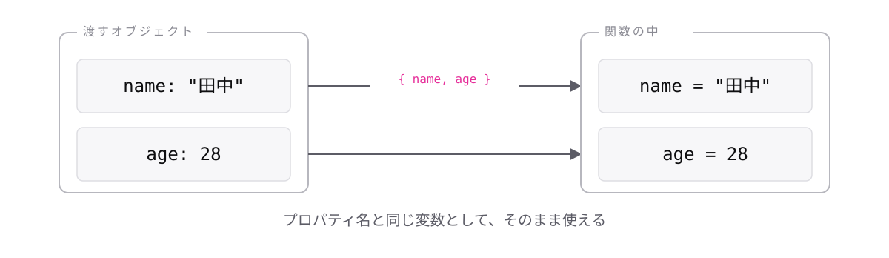

<!-- _class: lead -->

# 4-6-2
# 分割代入引数

TypeScript入門 — Module 4 / レッスン4-6

<!-- ノート: 分割代入は関数の引数でも使えます。次のトピックのパターンを組み立てる部品になります。 -->

---

## なぜ必要か

- オブジェクトを引数で受け取ると、中で毎回`引数名.`を書くことになる
- 受け取った直後に分割代入するのも、行が1つ増えて冗長

<!-- ノート: つかみ。関数の1行目が必ず分割代入になるなら、最初からそう書けたほうがよい。素朴な改善の話。 -->

---

## 結論

**引数の位置に分割代入を書くと、受け取ってすぐ中身を使える**

<!-- ノート: 結論を先に言い切る。新しい構文ではなく、4-6-1の分割代入を引数の位置に置くだけ。型注釈の位置だけ注意が要る。 -->

---

## 最小のコード

```ts
type User = { name: string; age: number };

const introduce = ({ name, age }: User): string => {
  return `${name}さん(${age}歳)`;
};

console.log(introduce({ name: "田中", age: 28 }));
// => "田中さん(28歳)"
```

<!-- ノート: 引数の位置に中かっこを書き、そのうしろにコロンと型を書く。型は分割代入した個々の変数ではなく、オブジェクト全体に対して付ける。3-4-1で学んだ型エイリアスがここで効いてくる。 -->

---

## 受け取りながら、取り出す



<!-- ノート: 呼び出し側はオブジェクトを1つ渡し、受け取り側では個々の変数として展開されている。型注釈をインラインで書くこともできるが長くなるので、型エイリアスで名前を付けるのが実務の基本。 -->

---

<!-- _class: summary -->

## まとめ

**引数の位置に分割代入を書くと、受け取ってすぐ中身を使える**

<!-- ノート: 結論の再掲だけ。この書き方が、引数が増えたときの読みにくさを解決すると予告して締める。 -->
