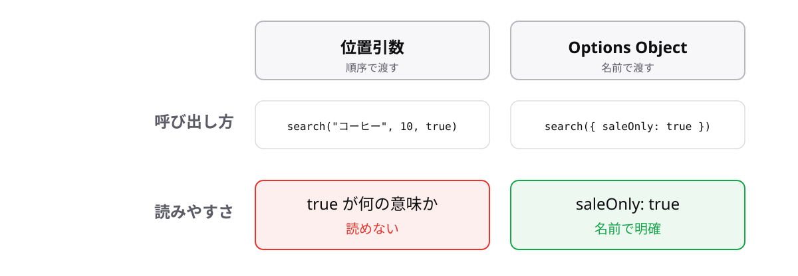

<!-- _class: lead -->

# 4-6-3
# Options Objectパターン

TypeScript入門 — Module 4 / レッスン4-6

<!-- ノート: Module 4の最後のトピックです。ここまでの道具を組み合わせて、実務でよく使われる設計パターンを1つ作ります。 -->

---

## なぜ必要か

- `search("コーヒー", 10, true, false)` は、呼び出し側を見ても意味が分からない
- 順番を1つ入れ替えても、型が同じなら気づけない

<!-- ノート: つかみ。真偽値が2つ並ぶと、どちらがどちらか分からない。しかも型が同じなので入れ替えてもエラーにならない。実務で実際に起きる事故。 -->

---

## 結論

**引数が3つを超えたら、オブジェクト1つにまとめて名前付きで渡す**

- この設計をOptions Objectパターンと呼ぶ

<!-- ノート: 結論を先に言い切る。3つという数は目安で、絶対のルールではない。真偽値が2つ以上並んだら早めに切り替える、という判断でもよい。 -->

---

## 最小のコード

```ts
type SearchOptions = {
  keyword: string;
  limit?: number;
  saleOnly?: boolean;
};

const search = ({ keyword, limit = 10, saleOnly = false }: SearchOptions): string => {
  return `${keyword} / ${limit}件 / セール限定:${saleOnly}`;
};

console.log(search({ keyword: "コーヒー", saleOnly: true }));
// => "コーヒー / 10件 / セール限定:true"
```

<!-- ノート: 4-6-2の分割代入引数、3-4-2のオプショナルプロパティ、4-3-2のデフォルト引数がすべて合流している。呼び出し側は必要な項目だけを名前付きで渡せる。 -->

---

## 位置で渡すか、名前で渡すか



<!-- ノート: 左が位置引数、右がOptions Object。右は順番が自由で、呼び出し側を読むだけで意味が分かる。ただし引数が1つか2つなら位置引数のほうが簡潔なので、使い分けが大事だと添える。 -->

---

<!-- _class: summary -->

## まとめ

**引数が3つを超えたら、オブジェクト1つにまとめて名前付きで渡す**

<!-- ノート: 結論の再掲だけ。Module 4はこれで終了。処理をまとめられるようになったので、次は型そのものを深く扱うと伝えて締める。 -->
