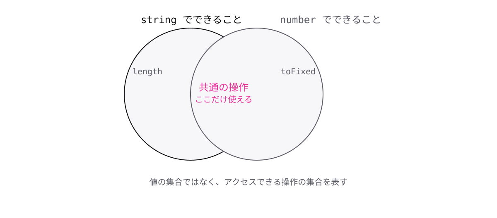

<!-- _class: lead -->

# 5-1-1
# ユニオン型は共通部分しか使えない

TypeScript入門 — Module 5 / レッスン5-1

<!-- ノート: Module 5は型システムを深く扱います。1-5-2で学んだユニオン型を、実務で使えるところまで持っていきます。 -->

---

## なぜ必要か

- 実務あるある: ユニオン型にしたら、その値が何も使えなくなった
- 理由が分からないと「型が邪魔をしている」と感じてしまう

<!-- ノート: つかみ。ユニオン型を覚えたてで必ずぶつかる壁。ここで理屈を理解しておくと、以降の絞り込みの必要性が腹落ちする。 -->

---

## 結論

**ユニオン型の値は、どちらの型でもできることしか使えない**

- `string | number` なら、両方に共通する操作だけ

<!-- ノート: 結論を先に言い切る。コンパイラーの立場に立つと当然の話。どちらが入っているか分からない以上、両方で安全なことしか許せない。 -->

---

## 最小のコード

```ts
const id: string | number = "A-1001";

console.log(id.length);
// エラー: Property 'length' does not exist on
// type 'string | number'.
```

- `length`は`string`にはあるが、`number`にはない

<!-- ノート: 値としては文字列が入っているが、型の上ではnumberの可能性が残っている。3-1-4で見た「型と実際の値がズレる」のとは逆で、こちらは型が正しく慎重に振る舞っている。 -->

---

## 使えるのは重なった部分だけ



<!-- ノート: 2つの円が重なった図。ユニオン型は「値としてはどちらか」だが、「できることは共通部分だけ」。この非対称さがユニオン型のいちばんの引っかかりどころ。解決策は2-3-2で学んだ絞り込み。 -->

---

<!-- _class: summary -->

## まとめ

**ユニオン型の値は、どちらの型でもできることしか使えない**

<!-- ノート: 結論の再掲だけ。プリミティブなら絞り込めるが、オブジェクトだとどうなるのか、という問いを残して締める。 -->
