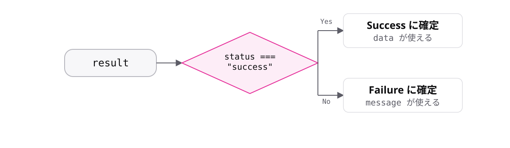

<!-- _class: lead -->

# 5-1-3
# 判別可能なユニオン型

TypeScript入門研修 — Module 5 / レッスン5-1

<!-- ノート: レッスン5-1の山場です。実務のTypeScriptで最も価値のある設計パターンの1つを扱います。 -->

---

## なぜ必要か

- プロパティの有無に頼る絞り込みは、型を変えると壊れる
- 「どちらの型か」を、型自身に語らせたい

<!-- ノート: つかみ。5-1-2の不満をそのまま引き継ぐ。推測で見分けるのではなく、最初から名札を付けておけばよい、という発想の転換。 -->

---

## 結論

**共通のプロパティにリテラル型の目印を付けると、確実に絞り込める**

- この設計を判別可能なユニオン型と呼ぶ
- 目印のプロパティをディスクリミネータと呼ぶ

<!-- ノート: 結論を先に言い切る。2語を定義する。ディスクリミネータは「判別するもの」の意味。1-5-1のリテラル型が、ここで決定的な役割を果たす。 -->

---

## 最小のコード

```ts
type Success = { status: "success"; data: string };
type Failure = { status: "failure"; message: string };

const result: Success | Failure = { status: "success", data: "OK" };

if (result.status === "success") {
  console.log(result.data); // ここではSuccessに確定
}
```

<!-- ノート: statusが両方の型にあるので、絞り込む前でもアクセスできる。値がリテラル型なので、比較すればどちらか一方に確定する。ここが仕組みの核心。 -->

---

## 目印で分岐 → 型が確定



<!-- ノート: 目印を見て分岐すると、その先では型が1つに決まる。switchでも同じことができ、2-4-3で学んだリテラルのユニオンとswitchの相性がここで生きる。目印にはリテラル型を使う(stringだと絞り込めない)。 -->

---

<!-- _class: summary -->

## まとめ

**共通のプロパティにリテラル型の目印を付けると、確実に絞り込める**

<!-- ノート: 結論の再掲だけ。レッスン5-1はここまで。絞り込みの道具は他にもあると予告して締める。 -->
