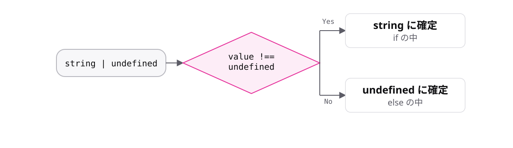

<!-- _class: lead -->

# 5-2-1
# 制御フロー分析

TypeScript入門研修 — Module 5 / レッスン5-2

<!-- ノート: レッスン5-2では絞り込みの仕組みそのものを扱います。2-3-2で「ifで型が確定する」と学びましたが、その裏側です。 -->

---

## なぜ必要か

- 「なぜ`if`の中だけ型が変わるのか」を説明できないと、応用が効かない
- 絞り込みが効かないときに、原因を推測できない

<!-- ノート: つかみ。仕組みを知らないと、うまくいかないときに手が止まる。ここを理解しておくと、以降の型ガードがすべて同じ原理だと分かる。 -->

---

## 結論

**コンパイラーは分岐を追いかけて、その位置での型を決めている**

- この仕組みを制御フロー分析と呼ぶ
- 型を狭める判定を型ガードと呼ぶ

<!-- ノート: 結論を先に言い切る。2語を定義する。型は変数ごとに1つ固定ではなく、コードの位置ごとに変わる。ここが未経験者にとって新しい発想。 -->

---

## 最小のコード

```ts
const value: string | undefined = "コーヒー";

// ここでは string | undefined

if (value !== undefined) {
  // ここでは string
} else {
  // ここでは undefined
}
```

<!-- ノート: 同じ変数なのに、位置によって型が違う。Playgroundで3か所それぞれにカーソルを乗せて確認させると、一発で伝わる。elseの側でも型が確定している点も見せる。 -->

---

## 分岐のたびに型が狭まる



<!-- ノート: 上から流れてきた型が、分岐ごとに枝分かれして狭まっていく。2-3-2で使ったifも、4-1-3の早期リターンも、すべてこの仕組みの上で動いている。判定の書き方が違うだけ。 -->

---

<!-- _class: summary -->

## まとめ

**コンパイラーは分岐を追いかけて、その位置での型を決めている**

<!-- ノート: 結論の再掲だけ。では判定の書き方にどんな種類があるのか、を次から見ると予告して締める。 -->
