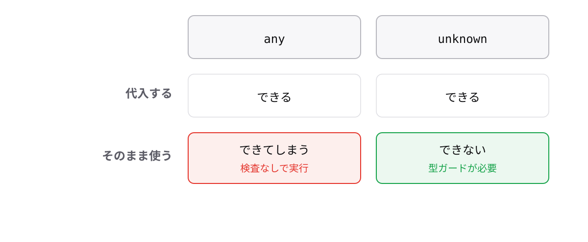

# レッスン5-3 any・unknown・never

## このレッスンの目標

- [ ] `any`が何を止めてしまうか説明できる
- [ ] `unknown`を使い、絞り込んでから利用できる
- [ ] `never`で分岐の書き漏れを検出できる

## 5-3-1 any型

> **`any`は全てのチェックを止める。使うとTypeScriptの利点が消える**

`any`は魅力的に見えます。赤い波線が全部消えるので、初学者ほど手が伸びます。だから先に危険性を知っておいてください。

```ts
const value: any = "コーヒー";

console.log(value.length); // OK
console.log(value.toFixed(2)); // OK(存在しないのに)
console.log(value.foo.bar); // OK(実行時に落ちる)
```

3行ともコンパイルを通ります。実際に動かすと2行目以降で実行時エラーになります。

**エラーが消えるのではなく、見えなくなるだけです。** 0-1-2で学んだ「実行前に間違いを見つける」という価値そのものが失われ、0-1-1で見た「気づくのが遅いバグ」に自ら戻ることになります。

付き合い方は次のとおりです。

- 自分から書かない
- 移行中の古いコードなど、やむを得ない場合だけ(理由をコメントで残す)
- 型が分からないなら、次の`unknown`を使う

なお、レッスン4-1で見た「引数の型注釈の書き忘れ」でも暗黙の`any`になります。`noImplicitAny`という設定で防げます(Module 9で扱います)。

## 5-3-2 unknown型

> **`unknown`は「型がわからない」ことを正直に表す型**

外部から届くデータは、実行するまで形が分かりません。分からないのに`string`と書くのは、型に嘘を書くことになります。

```ts
const value: unknown = "コーヒー";

console.log(value.length);
// エラー: 'value' is of type 'unknown'.
```

`unknown`は**何でも代入できますが、そのままでは何もできません。** 入れるのは自由、使うのは不自由。この非対称さが`any`との決定的な違いです。

使うには絞り込みます。

```ts
const value: unknown = "コーヒー";

if (typeof value === "string") {
  console.log(value.length); // => 4
}
```

5-2-2で学んだ`typeof`の型ガードがそのまま使えます。**「確かめてから使う」という手順を強制されるのが`unknown`の価値**です。新しい仕組みは何も出てきません。

## 5-3-3 anyとunknownの違い

> **`any`は検査を素通りさせ、`unknown`は検査を強制する**

どちらも「何でも入る」ので同じものに見えますが、違うのは出口のほうです。

| | 代入 | そのまま使う |
| --- | --- | --- |
| `any` | できる | **できてしまう** |
| `unknown` | できる | **できない** |



止められたら型ガードで通行証を得る、というイメージです。**止まることが安全につながります。**

選び方は単純です。

- 型が分からない → **`unknown`**
- どうしても止むを得ない → `any`(コメントで理由を残す)

迷ったら`unknown`と覚えて構いません。`unknown`で書いておけば後から型を特定する処理を足せますが、`any`で書くとそこから先は誰も検査しなくなります。

## 5-3-4 neverと網羅性チェック

> **`never`を使うと、分岐の書き漏れを実行前に検出できる**

レッスン2-4で「Module 5で分岐の書き漏れを検出する方法を学ぶ」と予告した、その回収です。

ユニオン型に選択肢を1つ足したとき、分岐の追加を忘れると、その選択肢だけ静かに素通りします。エラーにならないので気づけません。

`never`(ネバー)は**値が存在しない型**です。すべて分岐しきると、残りは`never`になります。

```ts
type Status = "todo" | "done";

const label = (status: Status): string => {
  switch (status) {
    case "todo":
      return "未着手";
    case "done":
      return "完了";
    default:
      const check: never = status; // 全部潰せていればOK
      return check;
  }
};
```

`default`に来る時点で`status`は全部潰されているので`never`です。`never`型の変数に`never`型の値を入れているだけなので、正常なら通ります。**この1行が見張り役になります。**

選択肢を足すと、その場でエラーになります。

```ts
type Status = "todo" | "done" | "cancelled"; // 追加した
// エラー: Type '"cancelled"' is not assignable to type 'never'.
```

`switch`を直さずに型だけ足すと、`default`の1行が赤くなります。「`cancelled`が残っているぞ」とコンパイラーが教えてくれるわけです。この仕掛けを**網羅性チェック**と呼びます。

## もっと知りたい人へ

- [any型](https://typescriptbook.jp/reference/values-types-variables/any) — anyの詳しい説明
- [unknown型](https://typescriptbook.jp/reference/statements/unknown) — unknownの詳しい説明
- [never型](https://typescriptbook.jp/reference/statements/never) — neverと網羅性チェック

---

演習は [practice.md](practice.md) にあります。
