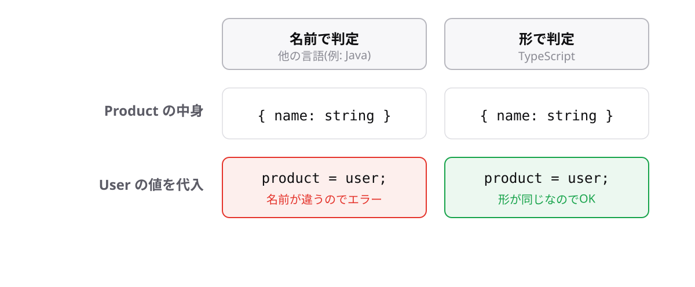

<!-- _class: lead -->

# 5-5-2
# 構造的型付け

TypeScript入門研修 — Module 5 / レッスン5-5

<!-- ノート: TypeScriptの型判定の根っこにある考え方です。ここを知らないと、後で「なぜ通るのか」が説明できなくなります。 -->

---

## なぜ必要か

- 別の名前の型なのに、代入できてしまうことがある
- 逆に、同じつもりで書いた型が通らないこともある

<!-- ノート: つかみ。型名が違えば別物、という直感は他の言語では正しいがTypeScriptでは違う。ここを押さえておくと、後の混乱が減る。 -->

---

## 結論

**TypeScriptは型の名前ではなく、形が合っているかで判定する**

- この考え方を構造的型付けと呼ぶ

<!-- ノート: 結論を先に言い切る。構造的型付けを定義する。JavaやC#は名前で判定する(公称型)。TypeScriptは形さえ合っていれば同じものとみなす。 -->

---

## 最小のコード

```ts
type User = { name: string };
type Product = { name: string };

const user: User = { name: "田中" };
const product: Product = user; // OK(形が同じ)
```

- 型名が違っても、形が同じなら代入できる

<!-- ノート: UserとProductはまったく別の意味の型だが、形が同じなので相互に代入できてしまう。意図しない互換性が生まれることがある、という注意点でもある。 -->

---

## 名前で見るか、形で見るか



<!-- ノート: 左が名前で判定する世界、右が形で判定する世界。TypeScriptは右。プロパティが多い分には代入できる(必要なものが揃っているため)。この柔軟さが、必要最小限の型で受け取る設計を可能にしている。 -->

---

<!-- _class: summary -->

## まとめ

**TypeScriptは型の名前ではなく、形が合っているかで判定する**

<!-- ノート: 結論の再掲だけ。形が合っていれば何でも通るのかというと、1つだけ例外があると引きを作って締める。 -->
