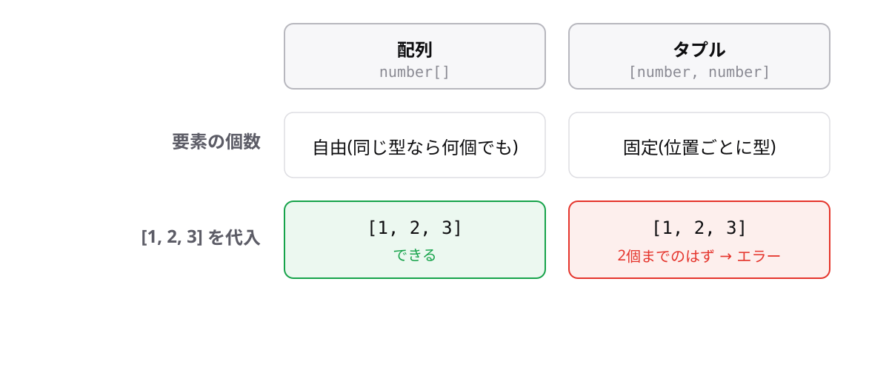

<!-- _class: lead -->

# 5-6-1
# タプル

TypeScript入門研修 — Module 5 / レッスン5-6

<!-- ノート: Module 5の最後のレッスンです。型を固定するための道具を4つ扱います。まずは配列の特殊形から。 -->

---

## なぜ必要か

- 「緯度と経度」「名前と年齢」のように、順番と個数が決まった組がある
- `number[]`だと、何個入っていてもよいことになってしまう

<!-- ノート: つかみ。3-1-1で学んだ配列は「同じ型の値がいくつでも」だった。ここでは「決まった型が決まった個数」を表したい。 -->

---

## 結論

**タプルは、要素の型と個数を固定した配列**

```
[型, 型]
```

<!-- ノート: 結論を先に言い切る。角かっこの中に型を並べる。3-1-1の number[] は「要素の型のうしろに[]」だったが、こちらは角かっこの中に型そのものを書く。見た目が似ているので区別を強調する。 -->

---

## 最小のコード

```ts
const point: [number, number] = [35.68, 139.76];

console.log(point[0]); // => 35.68

const wrong: [number, number] = [1, 2, 3];
// エラー: Source has 3 element(s) but target allows only 2.
```

<!-- ノート: 個数が違うと弾かれる。型の順番も固定なので、[35.68, "東京"] は [number, string] と書かなければならない。インデックスでのアクセスは配列と同じ。 -->

---

## 配列とタプルの違い



<!-- ノート: 配列は同じ型がいくつでも、タプルは決まった型が決まった個数。取り出すときは分割代入(4-6-1)の配列版が使える。ただし順番を覚える必要は残るので、項目が3つ以上ならオブジェクトのほうが読みやすいと添える。 -->

---

<!-- _class: summary -->

## まとめ

**タプルは、要素の型と個数を固定した配列**

<!-- ノート: 結論の再掲だけ。次は「使わないほうがよい機能」を扱うと予告して締める。 -->
