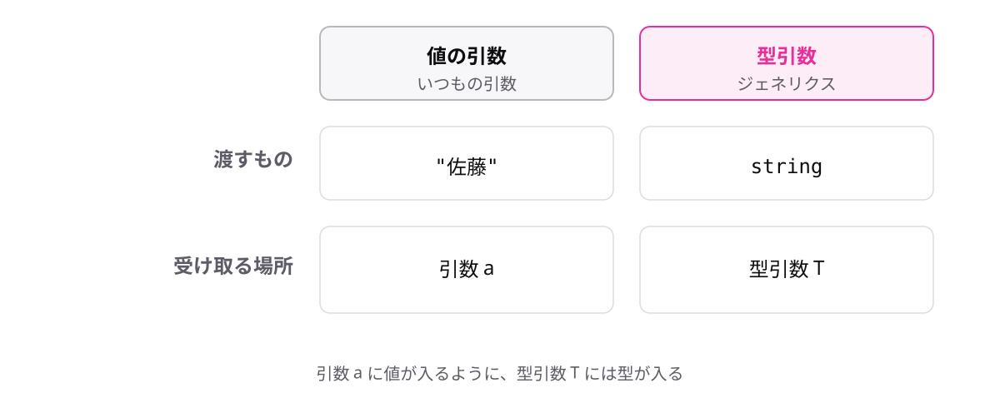
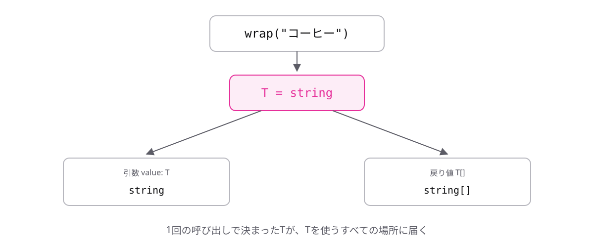

# レッスン6-1 ジェネリクスの基本

## このレッスンの目標

- [ ] ジェネリクスが何を解決するかを説明できる
- [ ] ジェネリック関数を書ける
- [ ] `extends`で型引数に制約を付けられる

## 6-1-1 型も引数にできる

> **ジェネリクスは、型を後から決められるようにする仕組み**

「配列の先頭を返す」処理を、`string[]`用と`number[]`用に2つ書くことになります。中身の処理はまったく同じで、型だけが違います。`any`にすれば動きますが、戻り値の型が分からなくなり、レッスン5-3で学んだとおり避けたい選択です。

- **型引数** — あとで決まる型を入れておく「型の変数」

```ts
// 型ごとに書いていた
const firstString = (items: string[]): string => items[0];
const firstNumber = (items: number[]): number => items[0];

// 型を引数にすれば1つで済む
const first = <T>(items: T[]): T => items[0];
```

値を受け取る引数と同じ発想を、型に対して行います。`T`は Type の頭文字で、慣習的によく使われる名前です。



`any`のように「何でもよい」のではなく、**呼び出しごとに1つに決まる**点が決定的な違いです。だから戻り値の型も分かります。

## 6-1-2 ジェネリック関数の書き方

> **関数名のうしろに`<T>`を書くと、`T`を型として使える**

```
const 関数名 = <T>(引数: T): T => { ... }
```

```ts
const wrap = <T>(value: T): T[] => [value];

console.log(wrap("コーヒー")); // => ["コーヒー"]
console.log(wrap(480)); // => [480]
```

この形の関数を**ジェネリック関数**と呼びます。山かっこの中が「これから使う型の名前の宣言」で、引数のかっこの手前に置きます。

1回目の呼び出しで`T`は`string`、2回目は`number`になります。名前は`T`でなくても構いません(要素なら`Item`など)が、慣習として`T`が多く使われます。



`any`と違って**入口と出口の型がつながっている**点が価値です。この記法は、Module 8で学ぶ`Promise<string>`とまったく同じものです。

## 6-1-3 型引数は推論される

> **型引数は渡した値から推論されるので、ふつうは書かなくてよい**

ジェネリクスは「呼ぶときも型を書く」と誤解されやすいのですが、レッスン1-2で学んだ型推論が型引数にも働きます。

```ts
const wrap = <T>(value: T): T[] => [value];

console.log(wrap<string>("コーヒー")); // 明示もできる
console.log(wrap("コーヒー")); // 推論に任せる(こちらが普通)
```

2行は同じ結果です。渡した値が`string`なので、`T`も`string`だと決まります。「推論できるなら任せる」という方針がここでも適用されます。

実は、もう使っていました。

```ts
const items = ["コーヒー", "紅茶"];
const upper = items.map((item) => `【${item}】`);
// map の型引数が string に推論されている
```

レッスン4-5で使った`map`はジェネリック関数です。だから`item`の型が分かり、戻り値も`string[]`になっていました。レッスン3-1で触れた`Array<number>`という書き方も同じ仕組みです。

## 6-1-4 extendsで制約を付ける

> **`T extends 型`と書くと、`T`に入れられる型を限定できる**

`T`は「どんな型か分からない」ので、関数の中で何もできません。レッスン5-3の`unknown`と同じ制約です。

```ts
const longer = <T>(a: T, b: T): T => {
  return a.length > b.length ? a : b;
  // エラー: Property 'length' does not exist on type 'T'.
};
```

制約を付けると使えるようになります。

```ts
const longer = <T extends { length: number }>(a: T, b: T): T => {
  return a.length > b.length ? a : b;
};

console.log(longer("コーヒー", "紅茶")); // => "コーヒー"
console.log(longer([1, 2, 3], [1])); // => [1, 2, 3]
```

「`length`を持つ型なら何でも」という制約です。文字列も配列も`length`を持つので通ります。

**制約を付けることは自由を減らすことですが、その見返りに中でできることが増えます。** 戻り値は`T`のままなので、渡した型の情報も失われません。

## もっと知りたい人へ

- [ジェネリクス](https://typescriptbook.jp/reference/generics) — ジェネリクスの詳しい説明

---

演習は [practice.md](practice.md) にあります。
