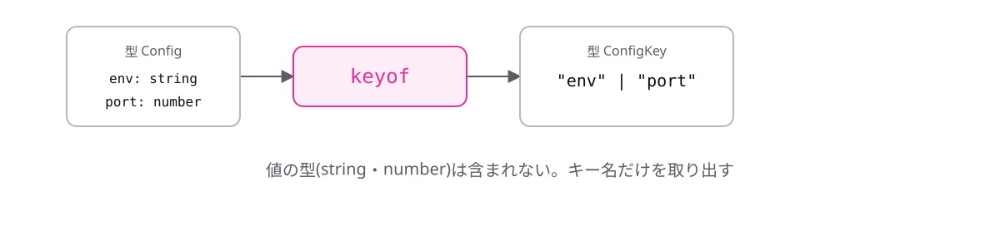

<!-- _class: lead -->

# 6-2-2
# keyof型演算子

TypeScript入門研修 — Module 6 / レッスン6-2

<!-- ノート: 型からプロパティ名の一覧を取り出す演算子です。次のトピックで、前の演算子と組み合わせます。 -->

---

## なぜ必要か

- 「このオブジェクトのプロパティ名だけを受け取る」関数を書きたい
- `string`だと、存在しない名前も渡せてしまう

<!-- ノート: つかみ。設定値を名前で取り出す関数を想像してもらう。名前をstringで受けると、タイポしても実行するまで気づけない。1-5-3のリテラル型で縛りたいが、手で書き写すと二重管理になる。 -->

---

## 結論

**`keyof`は、型のプロパティ名をリテラルのユニオン型にする**

<!-- ノート: 結論を先に言い切る。keyは「鍵」ではなく「キー = プロパティ名」の意味。出てくるのは1-5-3で学んだリテラルのユニオン型そのもの。新しい種類の型は出てこない。 -->

---

## 最小のコード

```ts
type Config = {
  env: string;
  port: number;
};

type ConfigKey = keyof Config;
// "env" | "port"
```

- 型を変えると、`ConfigKey`も自動で追従する

<!-- ノート: Configにプロパティを足せばConfigKeyにも増える。手で書き写す必要がない。Playgroundでカーソルを乗せると、リテラルのユニオン型が表示されることを確認させる。 -->

---

## プロパティ名がユニオン型になる



<!-- ノート: 型の左側(プロパティ名)だけを抜き出して、|でつないだものができる。この型を引数に使えば、存在しない名前は実行前に弾ける。 -->

---

<!-- _class: summary -->

## まとめ

**`keyof`は、型のプロパティ名をリテラルのユニオン型にする**

<!-- ノート: 結論の再掲だけ。値しか手元にないときはどうするのか、という問いを残して締める。 -->
