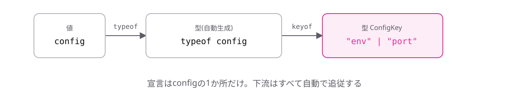

<!-- _class: lead -->

# 6-2-3
# keyof typeof

TypeScript入門 — Module 6 / レッスン6-2

<!-- ノート: 2つの演算子を組み合わせます。実務で最もよく見る形なので、ここは確実に読めるようにします。 -->

---

## なぜ必要か

- `keyof`は型に使うが、手元にあるのは値(設定オブジェクト)であることが多い
- 型を別途宣言するのは、6-2-1で嫌った二重管理そのもの

<!-- ノート: つかみ。keyofの入力は型、typeofの出力は型。つながる形をしている。素直につなげばよい、という気づきを促す。 -->

---

## 結論

**`keyof typeof` で、値から直接プロパティ名の型を作れる**

- `typeof`で値 → 型
- `keyof`で型 → プロパティ名のユニオン型

<!-- ノート: 結論を先に言い切る。読む順序は右から左。typeofが先に働き、その結果にkeyofが働く。2段階だと分けて読めば難しくない。 -->

---

## 最小のコード

```ts
const config = {
  env: "production",
  port: 3000,
} as const;

type ConfigKey = keyof typeof config;
// "env" | "port"
```

- 宣言は`config`の1か所だけ

<!-- ノート: 5-6-3で学んだas constも添えている。configに項目を足せばConfigKeyも自動で増える。値・型・キーの3つが1つの宣言から派生している状態。 -->

---

## 値 → 型 → キーの3段パイプライン



<!-- ノート: 3段のパイプライン。上流の値を1か所直せば、下流がすべて追従する。二重管理がなくなることが最大の価値。 -->

---

<!-- _class: summary -->

## まとめ

**`keyof typeof` で、値から直接プロパティ名の型を作れる**

<!-- ノート: 結論の再掲だけ。ではこれを使って何ができるのかを、次で実例にすると予告して締める。 -->
