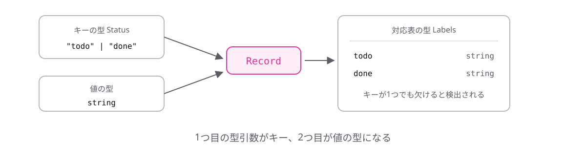

# レッスン6-3 Utility Types

## このレッスンの目標

- [ ] ユーティリティ型が何かを説明できる
- [ ] `Partial` / `Pick` / `Omit` を使い分けられる
- [ ] `Readonly` と `Record` を使える

## 6-3-1 ユーティリティ型とPartial

> **`Partial<T>`は、`T`の全プロパティを省略可能にした型を作る**

更新処理では「変更したい項目だけ」を受け取りたいものです。元の型と、全部省略可能にした型を2つ書くのは二重管理になります。

**ユーティリティ型**とは、標準で用意された「型を加工する型」です。山かっこは6-1-2で学んだ型引数と同じ記法です。

```ts
type User = {
  name: string;
  age: number;
};

type UserPatch = Partial<User>;
// { name?: string; age?: number }
```

`partial`は「部分的な」の意味です。レッスン3-4で学んだ`?`が、全プロパティに付いた状態になります。


`User`に項目を足せば`UserPatch`にも自動で反映されます。更新処理の引数の型としてそのまま使える、実務で頻出のパターンです。

## 6-3-2 Pick

> **`Pick<T, K>`は、`T`から指定したプロパティだけを取り出した型を作る**

一覧画面には名前だけ、詳細画面には全項目、というように必要な項目は画面ごとに違います。画面ごとに型を手で書くと、元の型を直したときに追従しません。

```ts
type User = {
  id: string;
  name: string;
  age: number;
  email: string;
};

type UserSummary = Pick<User, "id" | "name">;
// { id: string; name: string }
```

`pick`は「選ぶ」の意味です。型引数が2つあるのが新しい点ですが、山かっこの中にカンマで並べるだけです。

2つ目の型引数は`"id" | "name"`というリテラルのユニオン型で、レッスン1-5で学んだ書き方がそのまま使われています。存在しないプロパティ名を書くとエラーになります(`keyof`で制約されているためです)。


レッスン5-5で学んだ構造的型付けのおかげで「必要最小限の型で受け取る」設計ができます。その型を作る道具がこれです。

## 6-3-3 Omit

> **`Omit<T, K>`は、`T`から指定したプロパティを除いた型を作る**

「IDだけを除いた型」のように、除く項目のほうが少ない場面があります。

```ts
type User = {
  id: string;
  name: string;
  age: number;
};

type NewUser = Omit<User, "id">;
// { name: string; age: number }
```

`omit`は「省く」の意味で、書き方は`Pick`とまったく同じ、意味だけが逆です。

使い分けは単純です。

- 残す項目が少ない → `Pick`
- 除く項目が少ない → `Omit`

`Pick`で書くと`"name" | "age"`と並べることになり、項目が増えるたびに書き足しが必要です。`Omit`なら追従します。

**落とし穴が1つあります。**

```ts
type NewUser = Omit<User, "idd">; // タイポでもエラーにならない
// { id: string; name: string; age: number }
```

`Pick`は存在しないキーを書くとエラーになりますが、`Omit`はなりません(「存在しないものを除いた」だけなので成立してしまいます)。除いたつもりが残っている、という静かなバグになるので、結果の型を必ず確認してください。

## 6-3-4 ReadonlyとRecord

> **`Readonly`は全プロパティを読み取り専用に、`Record`は対応表の型を作る**

どちらも自分で書けますが、標準にあるなら使えばよく、名前が付いていることで意図も伝わります。

**Readonly** — レッスン3-4で1つずつ書いた`readonly`が、全プロパティに付きます。

```ts
type User = { name: string; age: number };

type FrozenUser = Readonly<User>;
// { readonly name: string; readonly age: number }

const user: FrozenUser = { name: "田中", age: 28 };
user.name = "佐藤";
// エラー: Cannot assign to 'name' because it is a read-only property.
```

レッスン5-6の`as const`と似ていますが、あちらは値に対する指定、こちらは型に対する加工です。

**Record** — キーと値の対応表の型を作ります。

```ts
type Status = "todo" | "done";

type Labels = Record<Status, string>;
// { todo: string; done: string }

const labels: Labels = { todo: "未着手", done: "完了" };
```

1つ目の型引数がキー、2つ目が値の型です。`Status`に`"doing"`を足すと、`labels`に書き漏れがある場合エラーになります。レッスン5-3の網羅性チェックと同じ効果が、型だけで得られます。



## もっと知りたい人へ

- [ユーティリティ型](https://typescriptbook.jp/reference/type-reuse/utility-types) — 標準のユーティリティ型の一覧

---

演習は [practice.md](practice.md) にあります。
