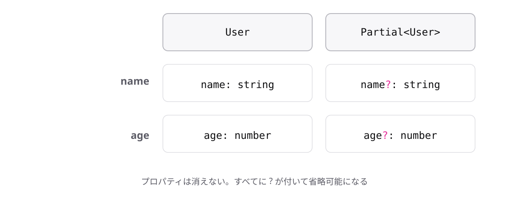

<!-- _class: lead -->

# 6-3-1
# ユーティリティ型とPartial

TypeScript入門 — Module 6 / レッスン6-3

<!-- ノート: Module 6の最後のレッスンです。ここまで学んだジェネリクスの応用が、実は標準で用意されています。 -->

---

## なぜ必要か

- 更新処理では「変更したい項目だけ」を受け取りたい
- 元の型と、全部省略可能にした型を2つ書くのは二重管理

<!-- ノート: つかみ。ユーザー情報の更新APIを想像してもらう。名前だけ変えたいときに、全項目を渡させるのはおかしい。かといって型を2つ書けば、片方だけ直して食い違う。 -->

---

## 結論

**`Partial<T>`は、`T`の全プロパティを省略可能にした型を作る**

- ユーティリティ型 = 標準で用意された、型を加工する型
- 山かっこは6-1-2で学んだ型引数と同じ記法

<!-- ノート: 結論を先に言い切る。ユーティリティ型を定義する。自分で作れるが標準にあるので使えばよい、というもの。partialは「部分的な」の意味。 -->

---

## 最小のコード

```ts
type User = {
  name: string;
  age: number;
};

type UserPatch = Partial<User>;
// { name?: string; age?: number }
```

- 3-4-2で学んだ`?`が、全プロパティに付いた状態

<!-- ノート: Userに項目を足せばUserPatchにも自動で反映される。手で書き写す必要がない。Playgroundでカーソルを乗せると展開後の型が見える。 -->

---

## 全プロパティが省略可能になる



<!-- ノート: 左が元の型、右がPartialを通した型。すべてのプロパティに?が付いている。更新処理の引数の型としてそのまま使える、実務で頻出のパターン。 -->

---

<!-- _class: summary -->

## まとめ

**`Partial<T>`は、`T`の全プロパティを省略可能にした型を作る**

<!-- ノート: 結論の再掲だけ。次は必要な項目だけを選ぶ道具に進むと予告して締める。 -->
