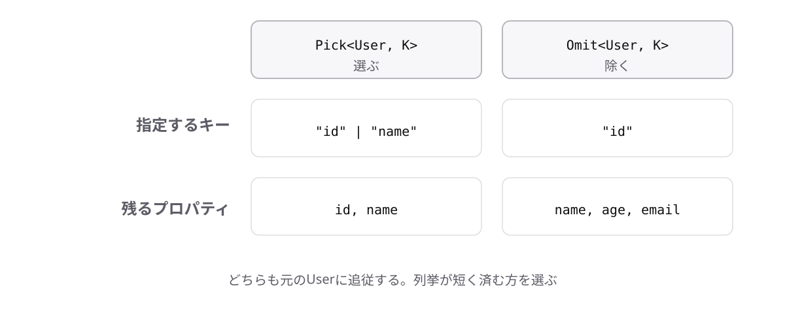

<!-- _class: lead -->

# 6-3-2
# Pick

TypeScript入門研修 — Module 6 / レッスン6-3

<!-- ノート: 型から必要な部分だけを取り出す道具です。実務では画面ごとに必要な項目が違うので、頻繁に使います。 -->

---

## なぜ必要か

- 一覧画面には名前だけ、詳細画面には全項目、というように必要な項目が違う
- 画面ごとに型を手で書くと、元の型を直したときに追従しない

<!-- ノート: つかみ。5-5-2で学んだ構造的型付けのおかげで「必要最小限の型で受け取る」設計ができる。その型を作る道具がこれ。 -->

---

## 結論

**`Pick<T, K>`は、`T`から指定したプロパティだけを取り出した型を作る**

- `K`にはプロパティ名をリテラルのユニオン型で渡す

<!-- ノート: 結論を先に言い切る。pickは「選ぶ」の意味。型引数が2つあるのが新しい点だが、6-1-2で学んだ山かっこの中にカンマで並べるだけ。 -->

---

## 最小のコード

```ts
type User = {
  id: string;
  name: string;
  age: number;
  email: string;
};

type UserSummary = Pick<User, "id" | "name">;
// { id: string; name: string }
```

<!-- ノート: 2つ目の型引数が "id" | "name" というリテラルのユニオン型。1-5-3で学んだ書き方がそのまま使われている。存在しないプロパティ名を書くとエラーになる(keyofで制約されているため)。 -->

---

## 選んで残すか、選んで除くか



<!-- ノート: Pickは選ぶ、Omitは除く(次のトピック)。同じ結果を両方から書けるので、残す項目が少なければPick、除く項目が少なければOmitと使い分ける。 -->

---

<!-- _class: summary -->

## まとめ

**`Pick<T, K>`は、`T`から指定したプロパティだけを取り出した型を作る**

<!-- ノート: 結論の再掲だけ。逆に「これ以外」を指定したい場合もあると引きを作って締める。 -->
