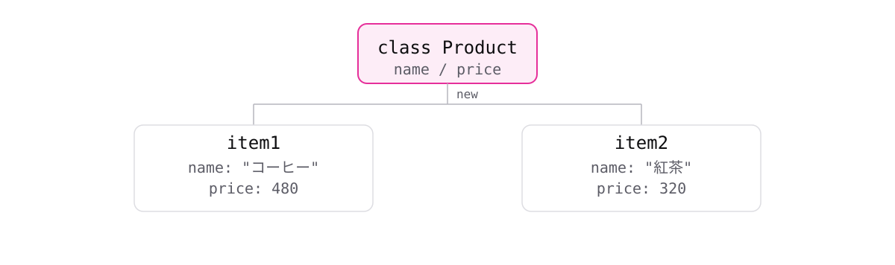
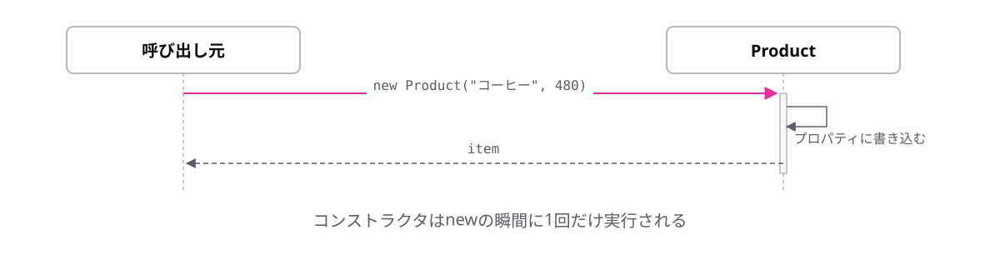
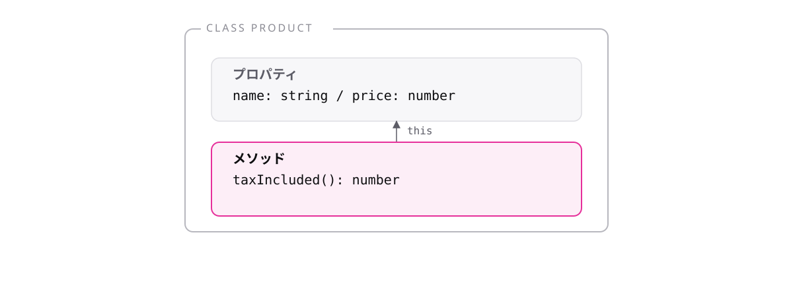

# レッスン7-1 クラスの基本

## このレッスンの目標

- [ ] クラスとインスタンスの関係を説明できる
- [ ] コンストラクタと`this`を使って初期化できる
- [ ] メソッドを定義して呼び出せる

## 7-1-1 クラスとは

> **クラスはデータと処理をまとめた設計図。`new`で実物を作る**

ここまで「データは型エイリアス、処理は関数」と分けて書いてきました。関連するものが離れていると、探すのも直すのも大変です。

- **クラス** — 設計図
- **インスタンス** — 設計図から作られた実物
- **`new`** — 実物を作る命令

```ts
class Product {
  name = "";
  price = 0;
}

const item = new Product();
console.log(item.name); // => ""
```

クラス名は大文字始まりにするのが慣習です。作ったあとの扱いは、レッスン3-3で学んだドット記法そのものです。



レッスン5-4で使った`new Error(...)`も、`Error`クラスからインスタンスを作っていました。あのときの「決まり文句」の正体がこれです。

型エイリアスは「形の定義」だけでしたが、**クラスは処理も一緒に持てる**点が違います。

## 7-1-2 プロパティの宣言

> **クラスのプロパティは、名前と型を並べて宣言する**

```
class クラス名 {
  プロパティ名: 型;
}
```

```ts
class Product {
  name: string = "";
  price: number = 0;
}

const item = new Product();
item.price = 480;
console.log(item.price); // => 480
```

型エイリアスと違い、`class`の中に書きます。初期値があれば型注釈は省略でき、レッスン1-2の方針どおり推論に任せて構いません。

初期値がないとエラーになります。

```ts
class Product {
  name: string;
  // エラー: Property 'name' has no initializer and is not
  // definitely assigned in the constructor.
}
```

インスタンスを作った直後に`undefined`が入るのを防ぐためのチェックです。メッセージの後半に`constructor`とありますが、そこで値を入れる方法が次のトピックです。

## 7-1-3 コンストラクタとthis

> **コンストラクタは`new`のときに動く初期化処理。`this`は自分自身を指す**

7-1-2の書き方だと、`new`してから`item.name = ...`と何行も書くことになり、レッスン3-3で見た「作るときの書き漏らし」がクラスでも起きます。

```
constructor(引数: 型) {
  this.プロパティ名 = 引数;
}
```

```ts
class Product {
  name: string;
  price: number;

  constructor(name: string, price: number) {
    this.name = name;
    this.price = price;
  }
}

const item = new Product("コーヒー", 480);
console.log(item.name); // => "コーヒー"
```

`new`のかっこに渡した値が、そのままコンストラクタの引数になります。`this.name`がプロパティ、右辺の`name`が引数で、**同じ名前ですが別物**です。



`new`が呼ばれる → 空のインスタンスができる → コンストラクタが動いてプロパティが埋まる、という順番です。`this`はその「空のインスタンス」を指しています。

**`this.`を書き忘れると、ただのローカル変数への代入になって何も起きません。**

## 7-1-4 メソッド

> **クラスの中に書いた関数をメソッドと呼び、`this`で自分のデータを使える**

税込価格の計算は、その商品のデータがあってこそ意味があります。関数を外に置くと、毎回データを引数で渡すことになります。

```ts
class Product {
  name: string;
  price: number;

  constructor(name: string, price: number) {
    this.name = name;
    this.price = price;
  }

  taxIncluded(): number {
    return Math.round(this.price * 1.1);
  }
}

const item = new Product("コーヒー", 480);
console.log(item.taxIncluded()); // => 528
```

`function`もアロー関数も書かず、関数名とかっこだけです。中では`this.price`で自分のデータにアクセスできるので、**引数が要りません。**



実は既に使っていました。レッスン3-2の`push`やレッスン4-5の`map`は、配列というオブジェクトが持つメソッドです。**ドット記法で呼ぶものはメソッド**と整理してください。

中で`this`を書き忘れると「Cannot find name 'price'」というエラーになります。

## もっと知りたい人へ

- [クラス](https://typescriptbook.jp/reference/object-oriented/class) — クラスの詳しい説明
- [コンストラクタ](https://typescriptbook.jp/reference/object-oriented/class/constructor) — コンストラクタの詳しい説明

---

演習は [practice.md](practice.md) にあります。
