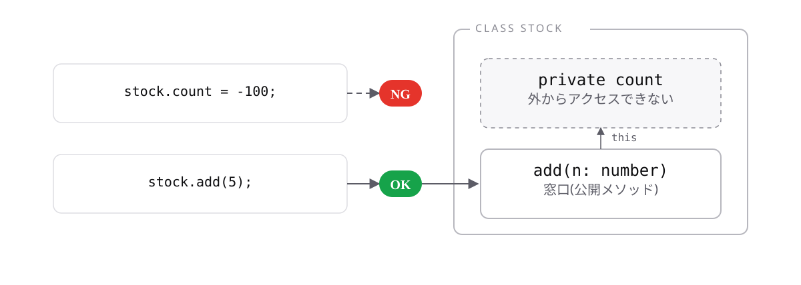

# レッスン7-2 カプセル化

## このレッスンの目標

- [ ] `private`でデータを隠し、メソッド経由で操作できる
- [ ] getterと`readonly`を使い分けられる
- [ ] `static`とコンストラクタショートハンドを使える

## 7-2-1 privateで隠す

> **`private`を付けたプロパティは、クラスの外から触れなくなる**

7-1のままだと`item.stock = -5`が通ってしまいます。外から誰でも書き換えられると、どこで壊れたのか追えません。

- **カプセル化** — データを隠し、決まった窓口だけを公開すること
- **アクセス修飾子** — 公開範囲を指定するキーワード(`public` / `private`)

`public`は「公開」で、何も書かないときの既定です。

```ts
class Stock {
  private count = 0;

  add(n: number): void {
    this.count = this.count + n;
  }
}

const stock = new Stock();
stock.add(5); // OK
stock.count = -100;
// エラー: Property 'count' is private and only
// accessible within class 'Stock'.
```

メソッド経由なら操作でき、直接の書き換えは弾かれます。`add`の中に「マイナスは受け付けない」といった検査を書けば、**不正な状態を作れなくなります。**



壊れたときに疑う場所がメソッドの中だけに絞られます。レッスン2-1で学んだ「使う範囲が狭いほど影響も狭い」という考え方と同じです。**迷ったら`private`から始めて、必要になったら公開してください。**

## 7-2-2 getterで読み取り専用の窓口を作る

> **`get`を付けたメソッドは、プロパティのように読める読み取り専用の窓口になる**

`private`で隠すと、外から値が読めなくなります。「表示はしたいが、書き換えさせたくない」場面のための仕組みが**getter**です。

```ts
class Stock {
  private count = 0;

  get current(): number {
    return this.count;
  }
}

const stock = new Stock();
console.log(stock.current); // => 0  (かっこは付けない)
stock.current = 10;
// エラー: Cannot assign to 'current' because it is
// a read-only property.
```

定義では`get`を付けてメソッドの形、呼び出しではかっこなしのプロパティの形です。読めるが書けません。

計算した値も返せます。

```ts
class Cart {
  private prices: number[] = [];

  get total(): number {
    let sum = 0;
    for (const price of this.prices) {
      sum = sum + price;
    }
    return sum;
  }
}
```

`total`は実際には保持しておらず、読まれるたびに計算しています。合計を別のプロパティで持つと更新漏れで食い違いますが、**getterならその事故が起きません。** 使う側は`cart.total`と書くだけで、中で計算されていることを知らなくて構いません。

## 7-2-3 クラスのreadonly

> **`readonly`を付けたプロパティは、コンストラクタでだけ値を入れられる**

`private`は「外から触れない」だけで、クラスの中からは自由に書き換えられます。うっかりメソッドの中で書き換える事故は防げません。

```ts
class Product {
  readonly id: string;
  name: string;

  constructor(id: string, name: string) {
    this.id = id; // OK(コンストラクタの中)
    this.name = name;
  }

  rename(newName: string): void {
    this.name = newName; // OK
    this.id = "X-999";
    // エラー: Cannot assign to 'id' because it is a read-only property.
  }
}
```

同じ`this.id`への代入が、コンストラクタでは通り、メソッドでは弾かれます。レッスン3-4の`readonly`と同じキーワードですが、クラスでは**「コンストラクタの中だけ例外」**というルールが加わります。


`private`と`readonly`は目的が違うので、`private readonly`のように組み合わせることもできます。

## 7-2-4 static

> **`static`を付けると、インスタンスを作らずクラス名から直接使える**

レッスン1-3や7-1-4で使った`Math.round`は、`new Math()`をしていません。その正体がこれです。

```ts
class Tax {
  static readonly RATE = 0.1;

  static calc(price: number): number {
    return Math.round(price * Tax.RATE);
  }
}

console.log(Tax.RATE); // => 0.1
console.log(Tax.calc(1000)); // => 100
```

`static`は「静的な」の意味で、インスタンスごとではなく**クラスに1つだけ存在します。** 定数は大文字で書く慣習があります。

`static`なメソッドの中では`this`が使えません(インスタンスが存在しないためです)。上の例でクラス名`Tax`を使って参照しているのはそのためです。

使いどころは限られます。

- クラス全体で共有する定数
- インスタンスの状態を使わない補助的な処理

何でも`static`にすると、クラスがただの関数置き場になってしまいます。**迷ったら通常のメソッドから始めてください。**

## 7-2-5 コンストラクタショートハンド

> **コンストラクタの引数に修飾子を付けると、宣言と代入を省略できる**

7-1-3で書いたコードでは、プロパティ名を宣言・引数・代入の**3か所**に書いていました。項目が5つあれば15回書くことになります。

```ts
// 省略前
class Product {
  private readonly id: string;
  private name: string;

  constructor(id: string, name: string) {
    this.id = id;
    this.name = name;
  }
}
```

```ts
// 省略後
class Product {
  constructor(
    private readonly id: string,
    private name: string,
  ) {}
}
```

引数に修飾子(`private`や`readonly`)を書くだけで、プロパティが自動で作られます。**修飾子を書くことが「これはプロパティです」という宣言も兼ねます。** TypeScript独自の記法で、JavaScriptにはありません。

注意点は、**修飾子を書き忘れると、ただの引数になってプロパティが作られない**ことです。何も書かない引数と混在させないほうが安全です。

## もっと知りたい人へ

- [アクセス修飾子](https://typescriptbook.jp/reference/object-oriented/class/access-modifiers) — public / private / protected
- [クラスのreadonly](https://typescriptbook.jp/reference/object-oriented/class/readonly-modifier-in-classes) — readonlyの詳しい説明
- [静的メンバー](https://typescriptbook.jp/reference/object-oriented/class/static-members) — staticの詳しい説明

---

演習は [practice.md](practice.md) にあります。
