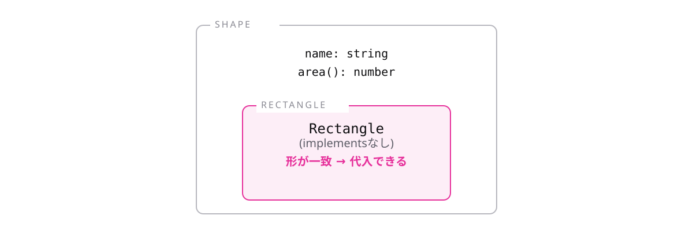

# レッスン7-4 インターフェース

## このレッスンの目標

- [ ] インターフェースで「形の約束」を書ける
- [ ] `implements`が何を検査しているか説明できる
- [ ] `interface`と`type`を使い分けられる

## 7-4-1 インターフェースとは

> **インターフェースは、実装を持たない「形の約束」を書くもの**

抽象クラスは継承なので、1つしか親を持てません。「面積を求められる」「名前を持つ」といった性質を複数まとめたいことがあります。また、実装を1つも持たないなら、クラスである必要もありません。

```
interface 名前 {
  プロパティ名: 型;
  メソッド名(引数: 型): 戻り値の型;
}
```

```ts
interface Shape {
  name: string;
  area(): number;
}

const circle: Shape = {
  name: "円",
  area: () => 3.14 * 2 * 2,
};

console.log(circle.area()); // => 12.56
```

レッスン3-4の型エイリアスとよく似ていますが、イコールを書きません。中身は一切書かず、名前と型だけです。

クラスを作らなくても、この形を満たすオブジェクトなら代入できます(レッスン5-5の構造的型付けが効いています)。

| | 実装を持てる | いくつ適用できる |
| --- | --- | --- |
| 抽象クラス | 持てる | 1つだけ |
| インターフェース | **持てない** | **いくつでも** |

共通の処理も持たせたいなら抽象クラス、約束だけなら軽いインターフェースです。実務ではインターフェースのほうが出番が多くなります。

## 7-4-2 implements

> **`implements`を書くと、クラスがその約束を守っているかを検査してもらえる**

```
class クラス名 implements インターフェース名 { ... }
```

```ts
interface Shape {
  name: string;
  area(): number;
}

class Circle implements Shape {
  name = "円";
  constructor(private radius: number) {}

  area(): number {
    return 3.14 * this.radius * this.radius;
  }
}
```

`extends`が「受け継ぐ」なのに対し、`implements`は「約束を守ると宣言する」です。**実装は自分で全部書く必要があり、もらえるのは「守れているかの検査」だけ**です。

```ts
class Square implements Shape {
  name = "正方形";
  // エラー: Class 'Square' incorrectly implements interface 'Shape'.
  //   Property 'area' is missing in type 'Square'.
}
```

何が足りないかを名指しで教えてくれます。レッスン3-3で見た`missing`エラーと同じ形です。

カンマで区切れば、複数のインターフェースを同時に`implements`できます。

## 7-4-3 インターフェースを型として使う

> **形が合っていれば、`implements`を書かなくてもその型として扱える**

継承だと親子関係が必要でしたが、インターフェースなら**無関係なクラス同士でも「同じ形」というだけでまとめられます。**

```ts
interface Shape {
  name: string;
  area(): number;
}

// implements を書いていない
class Rectangle {
  name = "長方形";
  constructor(private w: number, private h: number) {}
  area(): number {
    return this.w * this.h;
  }
}

const shapes: Shape[] = [new Rectangle(3, 4)]; // OK
```

`implements`がなくても、形が合っているので`Shape[]`に入れられます。レッスン5-5の「名前ではなく形」がここでも一貫しています。



**では`implements`は何のためにあるのか。** 答えは「クラス側で実装漏れを早く検出するため」です。書かなくても動きますが、書いておくとクラスを直したときにその場でエラーが出ます。使う側ではなく、**作る側のための安全装置**です。

## 7-4-4 interfaceとtypeの使い分け

> **本研修は`type`を基本にする。クラスの約束を書くときだけ`interface`**

オブジェクトの形は`type`でも`interface`でも書けます。基準がないと、書くたびに迷いレビューでも揉めます。

- `type`はユニオン型・交差型・関数型など、**何にでも名前を付けられる**
- `interface`が書けるのは**オブジェクトの形だけ**

```ts
type Status = "todo" | "done"; // ユニオン型
type Formatter = (name: string) => string; // 関数型
type User = Base & UserInfo; // 交差型
```

どれも`interface`では書けません。守備範囲の広い`type`に基本を寄せると迷いません。


`interface`には「同じ名前で複数回宣言すると自動で合体する」という性質があり、ライブラリーの型を拡張するときに使われます。ただし普段の開発では、意図せず合体してしまう事故のほうが問題になりやすいところです。

**配属先の規約が最優先である点は変わりません**(`interface`を基本にするチームもあります)。

## もっと知りたい人へ

- [インターフェース](https://typescriptbook.jp/reference/object-oriented/interface) — インターフェースの詳しい説明
- [型エイリアスとインターフェースの違い](https://typescriptbook.jp/reference/object-oriented/interface/difference-between-type-alias-and-interface) — 使い分けの詳細

---

演習は [practice.md](practice.md) にあります。
