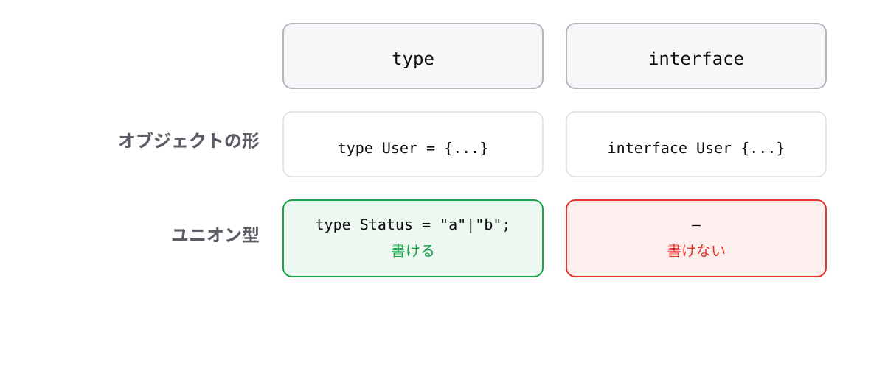

<!-- _class: lead -->

# 7-4-4
# interfaceとtypeの使い分け

TypeScript入門研修 — Module 7 / レッスン7-4

<!-- ノート: Module 7の最後のトピックです。ほとんど同じことができる2つの書き方に、判断基準を1つ決めます。 -->

---

## なぜ必要か

- オブジェクトの形は`type`でも`interface`でも書ける
- 基準がないと、書くたびに迷いレビューでも揉める

<!-- ノート: つかみ。1-1-3のconstファースト、4-2-3のアロー関数と同じ構図。技術的にどちらでもよいからこそ、決めておく。 -->

---

## 結論

**本研修は`type`を基本にする。クラスの約束を書くときだけ`interface`**

- `type`はユニオン型・交差型・関数型など、何にでも名前を付けられる
- `interface`が書けるのはオブジェクトの形だけ

<!-- ノート: 結論を先に言い切る。typeのほうが守備範囲が広いので、基本を寄せると迷わない。配属先の規約が最優先である点は必ず添える(interfaceを基本にするチームもある)。 -->

---

## typeにしか書けないもの

```ts
type Status = "todo" | "done"; // ユニオン型
type Formatter = (name: string) => string; // 関数型
type User = Base & UserInfo; // 交差型
```

<!-- ノート: 1-5-2、4-4-4、5-5-1で学んだ書き方。どれもinterfaceでは書けない。オブジェクトの形だけをinterfaceで書き、他はtypeにすると、書き分けの基準が2つになって混乱する。 -->

---

## 書けることの範囲が違う



<!-- ノート: 対比枠。interfaceには「同じ名前で複数回宣言すると自動で合体する」という性質があり、ライブラリーの型を拡張するときに使われる。ただし普段の開発では、意図せず合体してしまう事故のほうが問題になりやすい。 -->

---

<!-- _class: summary -->

## まとめ

**本研修は`type`を基本にする。クラスの約束を書くときだけ`interface`**

<!-- ノート: 結論の再掲だけ。Module 7はこれで終了。次はいよいよ非同期処理に進むと伝えて締める。 -->
