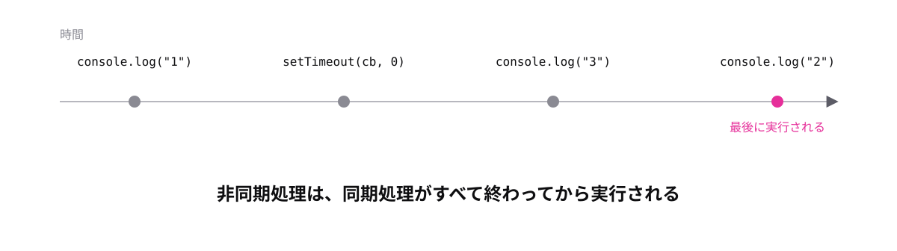

<!-- _class: lead -->

# 8-1-3
# 実行順序は書いた順ではない

TypeScript入門研修 — Module 8 / レッスン8-1

<!-- ノート: 非同期処理でいちばん驚くところです。ここを体感しておかないと、以降のコードが読めません。 -->

---

## なぜ必要か

- 上から順に読む癖のまま非同期のコードを読むと、必ず誤読する
- 「なぜかログの順番がおかしい」というデバッグで詰まる

<!-- ノート: つかみ。0秒後の予約でも順番が変わらない、という結果は直感に反する。だから一度自分で確かめてもらう価値がある。 -->

---

## 結論

**非同期処理は、同期処理がすべて終わったあとに実行される**

- 待ち時間が0でも、順番は変わらない

<!-- ノート: 結論を先に言い切る。予約された処理は「いま動いている仕事が全部片づいてから」実行される。担当者が1人なので、手が空くまで着手できない。 -->

---

## 最小のコード

```ts
console.log("1");

setTimeout(() => {
  console.log("2");
}, 0); // 0ミリ秒でも後回し

console.log("3");
// => 1
// => 3
// => 2
```

<!-- ノート: 実行前に順序を予想してもらってから動かすと効果的。0ミリ秒なのに2が最後に出る。「すぐ実行」ではなく「手が空いたら実行」だと分かる。 -->

---

## 0ミリ秒でも後回しにされる



<!-- ノート: 同期処理の列が全部終わってから、予約された処理が動く。この仕組みをイベントループと呼ぶが、名前は覚えなくてよい。「後回しにされる」という結果だけ押さえる。 -->

---

<!-- _class: summary -->

## まとめ

**非同期処理は、同期処理がすべて終わったあとに実行される**

<!-- ノート: 結論の再掲だけ。順番に処理をつなげたいときはどうするのか、という問いを残して締める。 -->
