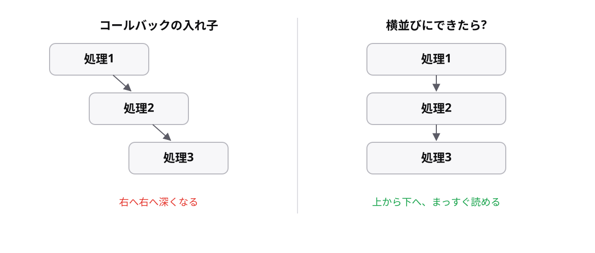

<!-- _class: lead -->

# 8-1-4
# コールバック地獄

TypeScript入門研修 — Module 8 / レッスン8-1

<!-- ノート: レッスン8-1の最後です。次のレッスンでPromiseを学ぶ理由を、ここで体感してもらいます。 -->

---

## なぜ必要か

- 実務では「取得してから、加工して、保存する」と順番に進めたい
- 非同期処理は待たないので、素直に並べても順番にならない

<!-- ノート: つかみ。8-1-3で見たとおり、setTimeoutを2つ並べても順番は保証されない。前の結果を使う処理は、前が終わってから始めるしかない。 -->

---

## 結論

**非同期処理をコールバックでつなぐと、入れ子が深くなって読めなくなる**

- この状態をコールバック地獄と呼ぶ

<!-- ノート: 結論を先に言い切る。順番を保証するには、前の処理の中に次を書くしかない。それを繰り返すと右へ右へ深くなる。 -->

---

## 最小のコード

```ts
setTimeout(() => {
  console.log("1件目を取得");
  setTimeout(() => {
    console.log("2件目を取得");
    setTimeout(() => {
      console.log("3件目を取得");
    }, 1000);
  }, 1000);
}, 1000);
```

- 3段でこれ。5段になると手に負えない

<!-- ノート: 中かっこの閉じ位置を追うだけで一苦労。しかもエラー処理を足すと、それぞれの段に書くことになってさらに膨らむ。実務で本当に起きる形。 -->

---

## 入れ子か、横並びか



<!-- ノート: 左が入れ子、右が次のレッスンで学ぶ書き方。同じ処理が縦に並ぶだけで、読みやすさがまったく違う。この右側の形を実現するのがPromise。 -->

---

<!-- _class: summary -->

## まとめ

**非同期処理をコールバックでつなぐと、入れ子が深くなって読めなくなる**

<!-- ノート: 結論の再掲だけ。レッスン8-1はここまで。これを解決する仕組みを次で学ぶと予告して締める。 -->
