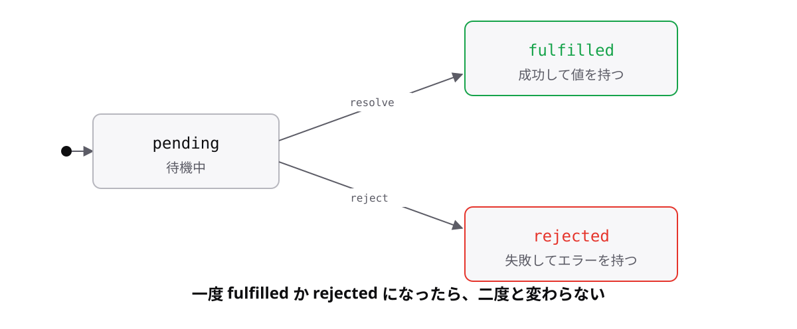

# レッスン8-2 Promise

## このレッスンの目標

- [ ] Promiseの3つの状態を説明できる
- [ ] `then`で結果を受け取り、つなげて書ける
- [ ] `Promise<T>`の型を書き、`catch`で失敗を扱える

## 8-2-1 Promiseとは

> **`Promise`は「あとで結果が入る箱」。成功か失敗のどちらかに一度だけ決まる**

コールバックは「処理を渡す」形でした。`Promise`は「結果を受け取る」形です。**値になるので、変数に入れたり関数から返したりできます。** これが8-1-4の入れ子から抜け出す鍵になります。

- **`resolve`** — 成功として結果を入れる
- **`reject`** — 失敗として理由を入れる

```ts
const order = new Promise((resolve) => {
  setTimeout(() => {
    resolve("コーヒーができました");
  }, 1000);
});

console.log(order); // => Promise { <pending> }
```

引換券のイメージです。券そのものはすぐもらえますが、中身は後から確定します。`new`で作るので、レッスン7-1で学んだクラスのインスタンスです。



保留中(pending)から、成功(fulfilled)か失敗(rejected)へ**一度だけ**移ります。逆戻りも二度目もありません。この単純さが、コールバックより扱いやすい理由です。

## 8-2-2 thenで結果を受け取る

> **`then`は結果が出たら動くコールバックを登録し、新しい`Promise`を返す**

箱の中身は、できあがるまで直接は取り出せません。「できたら教えて」と登録しておく必要があります。

```ts
const order = new Promise((resolve) => {
  setTimeout(() => resolve("コーヒー"), 1000);
});

order.then((item) => {
  console.log(`${item}ができました`);
});
// 1秒後 => "コーヒーができました"
```

`resolve`に渡した値が、そのまま引数`item`に入ります。

**肝は「新しい`Promise`を返す」ことです。** 戻り値が同じ種類だから、レッスン4-5の`map`と`filter`と同じようにつなげられます。

```ts
order
  .then((item) => `${item}を包装`)
  .then((packed) => console.log(`${packed}しました`));
// 1秒後 => "コーヒーを包装しました"
```

8-1-4の入れ子が、縦に並ぶ形になりました。`then`の中で`return`した値が、次の`then`の引数になります。

## 8-2-3 Promiseの型

> **`Promise<T>`の`T`には、成功したときの結果の型を書く**

Module 6でジェネリクスを学んでおいた理由がここです。**新しい記法は1つも出てきません。**

```ts
const order = (item: string): Promise<string> => {
  return new Promise((resolve) => {
    setTimeout(() => resolve(`${item}ができました`), 1000);
  });
};

order("コーヒー").then((message) => console.log(message));
```

山かっこは6-1-2で学んだ型引数そのものです。`Promise<string>`は「結果が文字列のPromise」と読みます。

戻り値の型を書いておくと、`then`のコールバックの引数の型が自動で決まります。6-1-1で見た「入口と出口の型がつながる」がここでも効いています。

```ts
const wait = (): Promise<void> => {
  return new Promise((resolve) => setTimeout(resolve, 1000));
};
```

山かっこは**省略できません**(省略すると「Generic type 'Promise&lt;T&gt;' requires 1 type argument(s).」というエラーになります)。返す値がなければ、レッスン4-4で学んだ`void`を使って`Promise<void>`と書きます。

## 8-2-4 catchとfinally

> **`reject`された失敗は`catch`で受け取り、`finally`は成否に関わらず動く**

通信は失敗しますし、在庫切れもあります。レッスン5-4の`try` / `catch` / `finally`と**同じ役割分担**です。名前が揃っているのは偶然ではなく、同じ考え方を非同期に持ち込んだためです。

```ts
const order = (stock: number): Promise<string> => {
  return new Promise((resolve, reject) => {
    if (stock === 0) {
      reject(new Error("在庫切れです"));
      return;
    }
    resolve("コーヒー");
  });
};
```

`reject`には`Error`を渡すのが基本です(5-4-1の`throw`と同じ形)。`reject`を呼んだあとに`return`して、`resolve`まで進まないようにしています。

```ts
order(0)
  .then((item) => console.log(item))
  .catch((error) => console.log("失敗:", error.message))
  .finally(() => console.log("処理終了"));
// => "失敗: 在庫切れです"
// => "処理終了"
```

失敗すると`then`は飛ばされ、`catch`へ移ります。5-4-2の`try`-`catch`とまったく同じ動きです。

## もっと知りたい人へ

- [Promise](https://typescriptbook.jp/reference/asynchronous/promise) — Promiseの詳しい説明

---

演習は [practice.md](practice.md) にあります。
