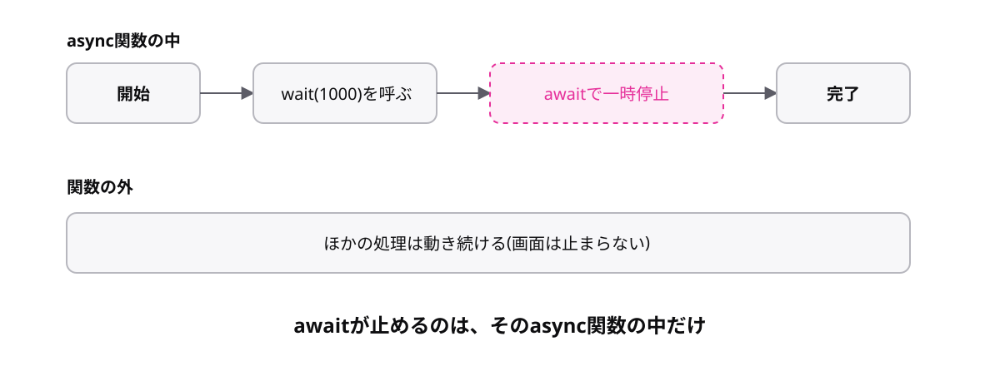
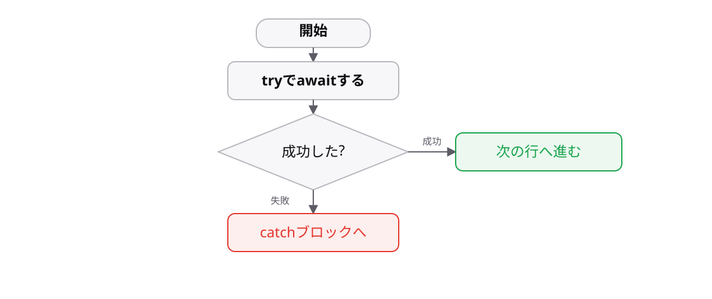

# レッスン8-3 async/await

## このレッスンの目標

- [ ] `async`関数を書ける
- [ ] `await`で結果を受け取り、`try`-`catch`でエラーを扱える
- [ ] `fetch`でAPIを呼び、届いたデータの型の扱いを説明できる

## 8-3-1 async関数

> **`async`を付けた関数は、`return`した値が自動で`Promise`に包まれる**

`new Promise(...)`を毎回書くのは長く、`then`のチェーンも長くなると読みにくくなります。

```ts
const getName = async (): Promise<string> => {
  return "コーヒー";
};

getName().then((name) => console.log(name)); // => "コーヒー"
```

`async`は asynchronous(非同期)の略です。関数の前に付けるだけで、その関数は**必ず`Promise`を返す関数**になります。`new Promise`も`resolve`も書いていません。

```ts
// asyncなし
const getName = (): Promise<string> => {
  return new Promise((resolve) => resolve("コーヒー"));
};

// asyncあり
const getName = async (): Promise<string> => "コーヒー";
```

戻り値の型は`Promise<string>`と書きます(中身の型ではありません)。8-2-3で学んだ書き方がそのまま使えます。

ただし`async`を付けただけでは待つことはできません。待つための記法が次のトピックです。

## 8-3-2 awaitで結果を待つ

> **`await`は`Promise`の結果が出るまで待ち、中身を取り出す**

8-2-2の`then`は、結果の使い道がコールバックの中に閉じていました。外に持ち出せると、その後の処理が素直に書けます。

```ts
const order = async (item: string): Promise<string> => {
  return `${item}ができました`;
};

const main = async (): Promise<void> => {
  const message = await order("コーヒー");
  console.log(message); // => "コーヒーができました"
};

main();
```

`await`を付けると`Promise<string>`から`string`が取り出せます。**`await`が書けるのは`async`関数の中だけ**です。



`await`で止まるのは**そのasync関数の中だけ**で、JavaScript全体が止まるわけではありません。8-1-1で見たシングルスレッドの制約は変わっていません。

**定番のミスは`await`の書き忘れです。** 値ではなく`Promise`そのものが入ってしまい、表示が`Promise { <pending> }`になります。

## 8-3-3 async/awaitのエラー処理

> **`await`した処理の失敗は、`try`-`catch`でそのまま受け止められる**

`await`で書くと`.catch()`をつなぐ場所がありません。どこでエラーを受けるのでしょうか。

答えは、レッスン5-4で学んだ道具がそのまま使えます。rejectされた`Promise`を`await`すると、**例外として投げられる**ためです。

```ts
const order = async (stock: number): Promise<string> => {
  if (stock === 0) {
    throw new Error("在庫切れです");
  }
  return "コーヒー";
};

const main = async (): Promise<void> => {
  try {
    const item = await order(0);
    console.log(item);
  } catch (error) {
    if (error instanceof Error) {
      console.log("失敗:", error.message);
    }
  }
};
```

`async`関数の中では`reject`の代わりに`throw`を書けます。受ける側は5-4-2の`try`-`catch`そのものです。**同期処理と書き方が揃う**のが async/await の大きな利点です。



`catch`の引数の型は、非同期でも`unknown`です(5-4-3)。`instanceof Error`で確かめてから`message`を読みます。

## 8-3-4 fetchでAPIを呼ぶ

> **`fetch`で取得したデータは型が保証されないので、自分で型を決めて扱う**

Webアプリの非同期処理の大半は、APIからのデータ取得です。レッスン5-3で「外部から届くデータは形が分からない」と話した、その現場です。

```ts
type User = { id: number; name: string };

const getUser = async (id: number): Promise<User> => {
  const response = await fetch(`https://example.com/users/${id}`);
  const data = await response.json();
  return data as User; // 形は自分で決めている
};
```

`fetch`は通信のための組み込み命令で、返るのが`Promise`なので`await`で受けられます。

**`await`が2回ある**点がハマりどころです。通信の完了で1回、本文の解析(`response.json()`)でもう1回必要になります。

**`as User`は「型の言い張り」です。** 実際にその形かは検査されていません。5-3-2で「分からないなら`unknown`」と学んだのに、ここでは断定しています。本番では、届いたデータを検査するライブラリー(zodなど)を使うのが定石です。

呼び出し側は8-3-3のとおりです。

```ts
const main = async (): Promise<void> => {
  try {
    const user = await getUser(1);
    console.log(user.name);
  } catch (error) {
    console.log("取得に失敗しました");
  }
};
```

通信は必ず失敗しうるので、エラー処理は省略できません。

## もっと知りたい人へ

- [async/await](https://typescriptbook.jp/reference/asynchronous/async-await) — async/awaitの詳しい説明
- [Promise](https://typescriptbook.jp/reference/asynchronous/promise) — 内部で動いているPromiseの仕組み

---

演習は [practice.md](practice.md) にあります。
