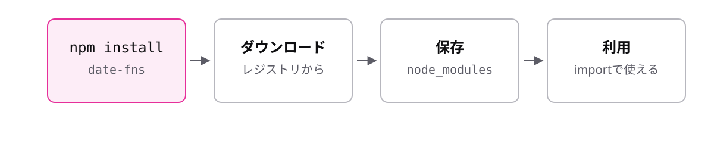

<!-- _class: lead -->

# 9-2-3
# npmとパッケージ

TypeScript入門研修 — Module 9 / レッスン9-2

<!-- ノート: 自分で書いたファイルの取り込み方は分かりました。次は他人が作った部品を使う方法です。 -->

---

## なぜ必要か

- 日付の整形、通信、テスト。よくある処理は誰かが既に作っている
- 全部自分で書くのは時間の無駄で、品質も劣る

<!-- ノート: つかみ。実務のプロジェクトは、依存パッケージが数十〜数百になるのが普通。車輪の再発明を避けるのがプロの仕事。 -->

---

## 結論

**`npm install`で他人が作った部品を導入し、`import`で使える**

- パッケージ = 公開されている再利用可能な部品
- `node_modules` = 導入したパッケージが置かれるフォルダ

<!-- ノート: 結論を先に言い切る。2語を定義する。npmは9-1-1で入れた道具。世界中の開発者が公開したパッケージを、コマンド1つで取り込める。 -->

---

## 導入して使う

```bash
npm install date-fns
```

```ts
import { format } from "date-fns";

console.log(format(new Date(), "yyyy/MM/dd"));
```

- 取り込み方は9-2-1と同じ。パスの代わりにパッケージ名を書く

<!-- ノート: ./ が付かない場合はパッケージ名として解釈される。この違いだけ。自分のファイルか外部の部品かが、パスの形で見分けられる。 -->

---

## コマンド1つで3つの仕事が起きる



<!-- ノート: installするとnode_modulesに実体がダウンロードされ、importで参照できるようになる。node_modulesは巨大だが、いつでも作り直せるのでgitで管理しない(.gitignoreに入れる)のが定石。消しても npm install でまた作れる。 -->

---

<!-- _class: summary -->

## まとめ

**`npm install`で他人が作った部品を導入し、`import`で使える**

<!-- ノート: 結論の再掲だけ。では何を導入したかはどこに記録されるのか、という問いを残して締める。 -->
