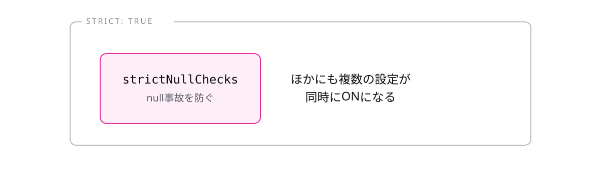

<!-- _class: lead -->

# 9-3-3
# strict

TypeScript入門研修 — Module 9 / レッスン9-3

<!-- ノート: tsconfigでいちばん重要な設定です。ここまでの研修で当たり前だと思っていたことが、実はこの設定のおかげでした。 -->

---

## なぜ必要か

- `strict: false` だと、TypeScriptの守りが大幅に緩む
- 緩いことに気づかないまま書くと、型があるのにバグが素通りする

<!-- ノート: つかみ。0-1-2で「型があると実行前に気づける」と話したが、それは設定次第。同じコードでも設定でエラーの出方が変わる。 -->

---

## 結論

**`strict`はチェックを厳しくする設定の詰め合わせ。必ず`true`にする**

- 8つほどの個別設定を一括で有効にする
- Playgroundでは既定で有効。だから研修中は意識せずに済んでいた

<!-- ノート: 結論を先に言い切る。1-6-5でstrictNullChecksに触れたが、あれはこの詰め合わせの1つ。研修で見てきたエラーの多くは、strictがONだからこそ出ていた。 -->

---

## 複数の設定をまとめてONにする

<!-- ノート: 個別に有効化もできるが、まとめてtrueにするのが実務の標準。個別の名前を全部覚える必要はなく、代表的な2つを次のトピックで見る。 -->

---

## 既存プロジェクトで false のときは

- いきなり`true`にすると、大量のエラーが出て手が止まる
- 個別の設定から段階的に有効化していく

<!-- ノート: 対比枠。新規プロジェクトなら最初からtrue一択。古いプロジェクトを引き継いだ場合は、noImplicitAnyから、という順序が現実的。配属先でfalseだったら、その事情を先輩に聞いてみるとよい。 -->

---

<!-- _class: summary -->

## まとめ

**`strict`はチェックを厳しくする設定の詰め合わせ。必ず`true`にする**

<!-- ノート: 結論の再掲だけ。中身のうち特に重要な2つを次で見ると予告して締める。 -->
