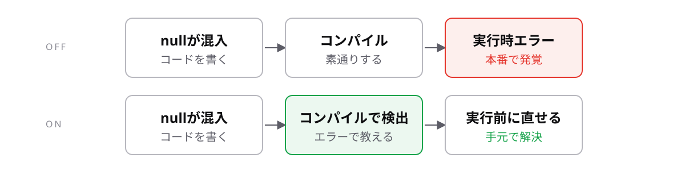

<!-- _class: lead -->

# 9-3-4
# noImplicitAnyとstrictNullChecks

TypeScript入門 — Module 9 / レッスン9-3

<!-- ノート: レッスン9-3の最後です。strictの中でも特に効く2つを、名前と効果で結びつけます。 -->

---

## なぜ必要か

- チームのtsconfigを読むとき、この2つの名前は必ず出てくる
- 効果を知っていれば、エラーが出たときに原因が分かる

<!-- ノート: つかみ。研修中に何度も出会ったエラーの正体が、この2つ。名前と効果が結びつくと、設定ファイルが読めるようになる。 -->

---

## 結論

**`noImplicitAny`は型の書き忘れを、`strictNullChecks`は空チェック漏れを止める**

<!-- ノート: 結論を先に言い切る。どちらもstrictに含まれる。研修で見てきた2種類のエラーが、それぞれこの設定に対応している。 -->

---

## 研修で見てきた2つのエラー

```ts
// noImplicitAny — 型の書き忘れ(4-1-2)
const calcTax = (price) => price * 0.1;
// エラー: Parameter 'price' implicitly has an 'any' type.

// strictNullChecks — 空チェック漏れ(1-6-5)
const phone: string | undefined = undefined;
console.log(phone.length);
// エラー: 'phone' is possibly 'undefined'.
```

<!-- ノート: implicitlyは「暗黙のうちに」。書かなければanyになるが、それを許さないのが1つ目。5-3-1で学んだとおりanyはすべてのチェックを止める。2つ目は使う前に確かめることを強制する設定。どちらも研修中に何度も出会ったエラー。 -->

---

## バグに気づく場所が変わる



<!-- ノート: OFFなら素通り、ONなら止まる。JavaScriptで最も有名な実行時エラー「Cannot read properties of undefined」を、この1設定で大幅に減らせる。 -->

---

<!-- _class: summary -->

## まとめ

**`noImplicitAny`は型の書き忘れを、`strictNullChecks`は空チェック漏れを止める**

<!-- ノート: 結論の再掲だけ。レッスン9-3はここまで。次は研修最後のテーマ、チームで書式を揃える道具に進むと予告して締める。 -->
