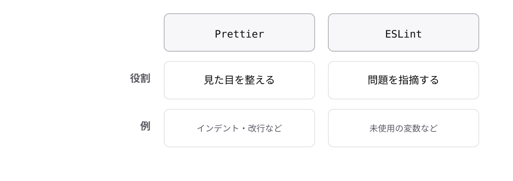

# レッスン9-4 PrettierとESLint

## このレッスンの目標

- [ ] Prettierで書式を自動で揃えられる
- [ ] PrettierとESLintの役割の違いを説明できる
- [ ] 保存時整形とCIで、人の手に頼らない仕組みを作れる

## 9-4-1 Prettier

> **Prettierはコードの見た目を自動で揃える。書式の議論をなくす道具**

インデント、クォート、改行位置は人によって違います。レビューで書式の指摘が並ぶと、本題の議論に時間を割けません。

**フォーマッター**はコードの見た目を整える道具です。**中身(動き)は一切変えません。** だから安心して実行できます。

```bash
npm install --save-dev prettier
npx prettier --write src
```

`--write`で実際にファイルを書き換えます(付けないと確認だけで書き換わりません)。開発中だけ必要なので`--save-dev`です。

```ts
// Before
const user = {name:"田中",  age:28}
```

```ts
// After
const user = { name: "田中", age: 28 };
```

スペース、セミコロン、クォートが自動で揃います。**レッスン1-4で「本研修はダブルクォート」と決めたのは、Prettierの既定に合わせるためでした。**

## 9-4-2 設定は最小限にする

> **Prettierの設定項目は意図的に少ない。既定のまま使うのが基本**

設定できると分かると細かく調整したくなりますが、調整項目が増えるほどチームで議論する種も増えます。9-4-1で「議論をなくす道具」と言ったのに、設定で議論が生まれては本末転倒です。

他の整形ツールは設定項目が数百ありましたが、Prettierは意図的に絞っています。**これは欠陥ではなく設計思想です。**

```json
// .prettierrc
{
  "semi": true,
  "singleQuote": false
}
```

`semi`はセミコロンの有無、`singleQuote`はシングルクォートを使うかです。どちらも既定と同じ値なので、実際には書かなくて構いません。

設定より大事なことが2つあります。

- **プロジェクト全体に一度かける** — 途中から導入すると整形だけの巨大な差分が1回出ます。本来の変更と混ぜないよう、単独でコミットするのが定石です
- **チームで同じバージョンを使う** — バージョンが違うと整形結果が変わり、無限に差分が出ます(`package.json`で固定されます)

## 9-4-3 ESLint

> **ESLintは書き方の問題を指摘する。Prettierとは役割が違う**

見た目が整っていても、危ない書き方は残ります。型チェックでは拾えない問題(使っていない変数、`==`の使用など)があります。

**リンター**はコードの品質上の問題を検出する道具です。`lint`は「糸くず」の意味で、コードに紛れた小さな問題を取り除くイメージです。



**両方入れるのが標準**で、競合しないよう役割を分ける設定が用意されています。どちらか一方ではありません。

```ts
const total = 100;
const tota1 = 200; // 使っていない(タイポ)
// warning: 'tota1' is assigned a value but never used.

if (a == b) { }
// error: Expected '===' and instead saw '=='.
```

どちらも型としては正しいのでコンパイラーは通します。レッスン2-2で「常に`===`を使う」と決めましたが、**それを機械に守らせられます。** `--fix`を付ければ自動修正できるものもあります。

## 9-4-4 自動で回す

> **整形は保存時に、検査はpush時に。人の手で回さない仕組みにする**

毎回コマンドを打つのは必ず忘れます。忘れた状態のコードがチームに混ざると、道具を入れた意味がなくなります。

**CI**はコードを送るたびに自動で検査を実行する仕組みです(Continuous Integration の略ですが、「pushしたら自動で走る」という理解で十分です)。

**VS Codeで保存時に整形する**

- 拡張機能「Prettier」を入れる
- 設定で「保存時にフォーマット」を有効にする

これだけで整形を意識しなくてよくなります。チーム全員が同じ設定になるよう、プロジェクトに設定ファイルを置いて共有するのが定石です。

**push前の3点セット**

```bash
npx tsc --noEmit   # 型チェック
npx prettier --check src
npx eslint src
```

`--noEmit`はファイルを出力せず型チェックだけ行う指定です。この3つを`package.json`の`scripts`にまとめておき、CIでも同じものを実行します。**手元とCIで同じコマンドが動くのが理想です。**


CIで落ちたら、そのコードはマージできません。厳しく見えますが、**壊れたコードが本番に届かないための仕組み**です。

レッスン0-1で見た「気づくのが遅いほど手間が増える」の、チーム版の答えがこれです。型もCIも、**機械に守らせる**という同じ思想の道具です。

## もっと知りたい人へ

- [Prettier](https://typescriptbook.jp/tutorials/prettier) — 導入と設定の詳しい説明
- [ESLint](https://typescriptbook.jp/tutorials/eslint) — ルールと設定の詳しい説明

---

演習は [practice.md](practice.md) にあります。

**研修はこれで終了です。おつかれさまでした。**
