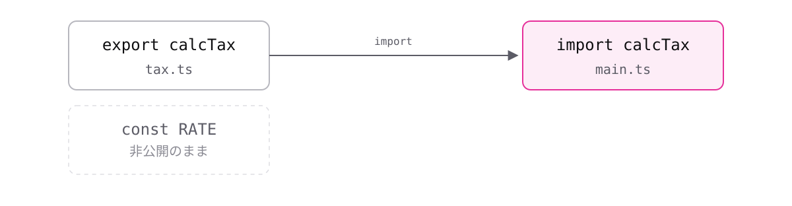

# レッスン9-2 モジュールとパッケージ

## このレッスンの目標

- [ ] `export` / `import`でファイルを分けられる
- [ ] 名前付きとデフォルトの違いを説明できる
- [ ] `npm install`でパッケージを導入し、`package.json`を読める

## 9-2-1 exportとimport

> **`export`で公開し、`import`で取り込む。書かなければファイルの外から見えない**

1ファイルに全部書くとすぐに何千行にもなりますが、分けると互いの関数が見えなくなります。レッスン2-1で学んだスコープと同じ話が、ファイル単位で起きます。

**モジュール**とは、`export`を持つファイル1つのことです。既定は非公開で、公開したいものだけ`export`を付けます(7-2-1の`private`と同じ「狭くしておく」考え方です)。

```ts
// tax.ts
export const calcTax = (price: number): number => price * 0.1;

const RATE = 0.1; // exportしていないので外から見えない
```

```ts
// main.ts
import { calcTax } from "./tax";

console.log(calcTax(1000)); // => 100
```

`export`は宣言の前に付けるだけです。`import`は波かっこで名前を指定し、`from`の後ろにファイルのパスを書きます(拡張子の`.ts`は書きません)。型エイリアスも`export`できます。



パスの`./`は「同じフォルダ」を意味します。**書き忘れると別の場所を探しに行ってエラーになる**のが定番のつまずきです。

## 9-2-2 名前付きとデフォルト

> **本研修は名前付きエクスポートを基本にする。名前が固定されるため**

`import React from "react"`のように、波かっこのない`import`を見かけます。書き方が2つあると毎回迷うので、基準を決めます。

```ts
// tax.ts
export const calcTax = (p: number): number => p * 0.1; // 名前付き
export default calcTax; // デフォルト
```

```ts
// main.ts
import { calcTax } from "./tax"; // 名前が固定
import anyName from "./tax"; // 好きな名前を付けられる
```

- **名前付きエクスポート** — 波かっこが要る。名前が固定される
- **デフォルトエクスポート** — 波かっこが要らない。1ファイルに1つだけ

波かっこの有無を取り違えるのが、`import`で最も多いエラーです。

名前付きを選ぶ理由は2つあります。

1. 名前がファイルをまたいで揃うので、**検索で追える**
2. タイポは実行前にエラーになる(存在しない名前は取り込めない)

デフォルトだと、同じものが人によって違う名前で取り込まれ、検索で追えなくなります。ライブラリー側がデフォルトで公開している場合は、そのまま従います。**配属先の規約が最優先である点は変わりません。**

## 9-2-3 npmとパッケージ

> **`npm install`で他人が作った部品を導入し、`import`で使える**

日付の整形、通信、テスト。よくある処理は誰かが既に作っています。全部自分で書くのは時間の無駄で、品質も劣ります。

- **パッケージ** — 公開されている再利用可能な部品
- **`node_modules`** — 導入したパッケージが置かれるフォルダ

```bash
npm install date-fns
```

```ts
import { format } from "date-fns";

console.log(format(new Date(), "yyyy/MM/dd"));
```

取り込み方は9-2-1と同じで、パスの代わりにパッケージ名を書きます。**`./`が付かない場合はパッケージ名として解釈されます。** 自分のファイルか外部の部品かが、パスの形で見分けられます。


`node_modules`は巨大ですが、いつでも作り直せるので**gitで管理しない**(`.gitignore`に入れる)のが定石です。

## 9-2-4 package.json

> **`package.json`はプロジェクトの設計図。これがあれば環境を再現できる**

チームで開発するとき、全員が同じパッケージを使う必要があります。`node_modules`は巨大なので、実体を配るのではなく**リストを配ります。**

```json
{
  "name": "my-app",
  "scripts": {
    "build": "tsc"
  },
  "dependencies": {
    "date-fns": "^4.1.0"
  },
  "devDependencies": {
    "typescript": "^5.6.0"
  }
}
```

- **`dependencies`** — 本番でも必要なもの
- **`devDependencies`** — 開発中だけ必要なもの

9-1-3で`typescript`を`--save-dev`で入れたのは、変換が終われば本番では不要だからです。

`scripts`に書いた名前は`npm run build`で実行できます。

動かなくなったときの定番の対処も覚えておいてください。

```bash
rm -rf node_modules
npm install
```

`node_modules`は**使い捨ててよいフォルダ**です。設計図さえあれば何度でも作り直せると理解していると、恐れずに消せます。

## もっと知りたい人へ

- [import、export、require](https://typescriptbook.jp/reference/import-export-require) — モジュールの詳しい説明
- [パッケージ](https://typescriptbook.jp/reference/package) — npmとpackage.jsonの詳しい説明

---

演習は [practice.md](practice.md) にあります。
