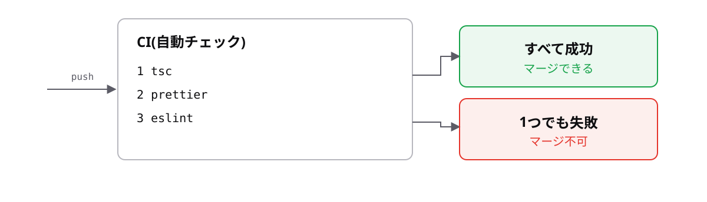

<!-- _class: lead -->

# 9-4-4
# 自動で回す

TypeScript入門研修 — Module 9 / レッスン9-4

<!-- ノート: 研修最後のトピックです。道具を揃えただけでは意味がない、という話をして締めます。 -->

---

## なぜ必要か

- 毎回コマンドを打つのは、必ず忘れる
- 忘れた状態のコードがチームに混ざると、道具を入れた意味がなくなる

<!-- ノート: つかみ。人の意志に頼る運用は破綻する。研修全体を通して繰り返してきた「機械に守らせる」という考え方の、最後の適用先。 -->

---

## 結論

**整形は保存時に、検査はpush時に。人の手で回さない仕組みにする**

- CI = コードを送るたびに、自動で検査を実行する仕組み

<!-- ノート: 結論を先に言い切る。CIはContinuous Integration(継続的インテグレーション)の略。名前より「pushしたら自動で走る」という理解で十分。 -->

---

## 2か所で自動化する

**保存時** — VS Codeに拡張機能「Prettier」を入れ、保存時整形を有効にする

**push時** — 次の3点をCIで実行する

```bash
npx tsc --noEmit   # 型チェック
npx prettier --check src
npx eslint src
```

<!-- ノート: 9-1-2で入れたVS Codeの設定で、整形を意識しなくてよくなる。--noEmitはファイルを出力せず型チェックだけ行う指定。この3つをpackage.jsonのscriptsにまとめ、手元とCIで同じコマンドが動くようにするのが理想。 -->

---

## pushしたら自動でチェックが走る



<!-- ノート: CIで落ちたら、そのコードはマージできない。厳しく見えるが、壊れたコードが本番に届かないための仕組み。0-1-1で見た「気づくのが遅いほど手間が増える」の、チーム版の答えがこれ。研修はここで終了。おつかれさまでした。 -->

---

<!-- _class: summary -->

## まとめ

**整形は保存時に、検査はpush時に。人の手で回さない仕組みにする**

<!-- ノート: 結論の再掲。研修の締めくくりとして、Module 0からここまで一貫して「機械に守らせる」話をしてきたことを振り返る。型もCIも、同じ思想の道具だと伝えて終える。 -->
